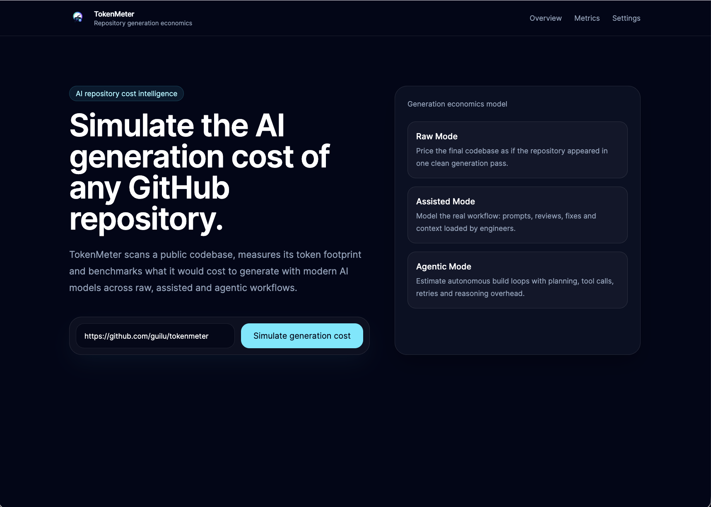
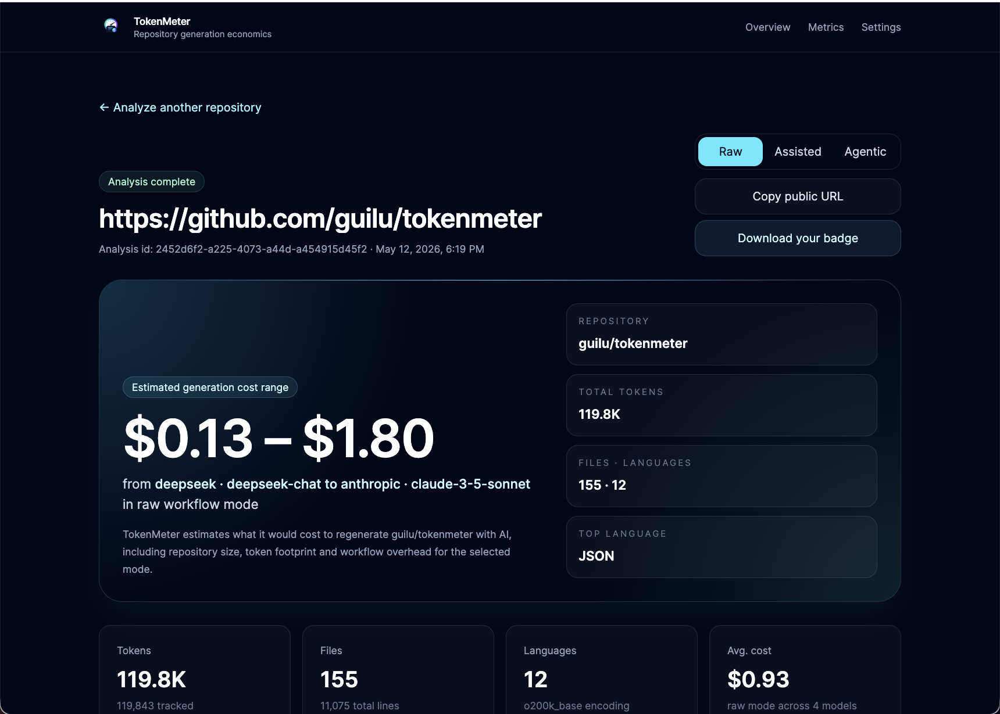
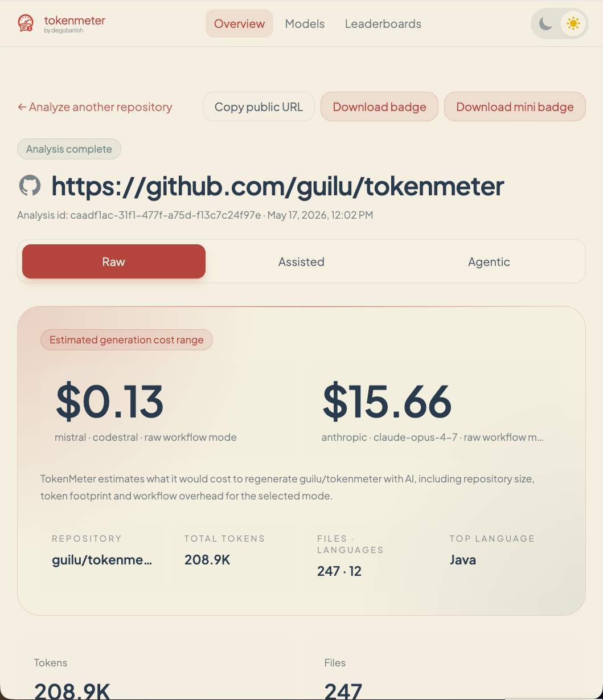

<p align="center">
 
</p>
<p align="center">
 Calcula cuánto habría costado generar un repositorio completo usando IA.
</p>

<p align="center">
 
 
 
 
 
</p>

---

TokenMeter analiza repositorios públicos de GitHub, cuenta tokens con un encoder real (`jtokkit` / `o200k_base`) y calcula el coste estimado de generación con varios modelos de IA bajo tres modos de uso (`raw`, `assisted`, `agentic`).

> [!IMPORTANT]
> El modo `raw` solo cuenta los tokens del código final (sin prompts, sin reintentos, sin razonamiento extra). Los modos `assisted` y `agentic` aplican multiplicadores fijos para aproximar overhead de input/razonamiento, pero siguen siendo una **estimación con suelo** — no contabilidad exacta.

---

# 📸 Capturas

<table>
  <tr>
    <td align="center" width="33%">
      <a href="./docs/assets/tokenmeter-1.png">
        
      </a>
      <br/>
      <sub><b>Home</b></sub>
    </td>
    <td align="center" width="33%">
      <a href="./docs/assets/tokenmeter-2.png">
        
      </a>
      <br/>
      <sub><b>Análisis</b></sub>
    </td>
    <td align="center" width="33%">
      <a href="./docs/assets/tokenmeter-3.png">
        
      </a>
      <br/>
      <sub><b>Resultado</b></sub>
    </td>
  </tr>
</table>

---

# 🚀 Características

| Característica | Descripción |
|---|---|
| 🌍 Repos públicos GitHub | Analiza cualquier repositorio público simplemente con su URL |
| 📄 Conteo de tokens | Estimación aproximada de tokens por archivo y repositorio |
| 💸 Coste estimado | Combina tokens × precios input/output reales por modelo |
| 📊 Tres modos | `raw`, `assisted` y `agentic` con multiplicadores fijos |
| 📈 Desglose detallado | Por lenguaje, extensión, carpeta y archivos |
| 🔗 Reportes públicos | Comparte resultados mediante URL |
| 🛠 Open Source | Proyecto transparente y extensible |
| 🗄 Histórico | Guarda y compara análisis |
| ⚙️ Precios configurables | Soporte para distintos modelos |

---

# 🧠 Modos de estimación

Definidos en [`CostEstimationMode`](backend/src/main/java/dev/diegobarrioh/tokenmeter/domain/cost/CostEstimationMode.java):

| Modo | Output × base | Input × base | Interpretación |
|---|---:|---:|---|
| 🟢 `raw` | 1 | 0 | Solo tokens del código final. Suelo absoluto. |
| 🔵 `assisted` | 5 | 1 | IA + iteraciones humanas + razonamiento moderado. |
| 🟣 `agentic` | 20 | 4 | Agente autónomo: iteraciones, herramientas, razonamiento. |

---

# ⚙️ Cómo funciona
1. Recibe URL del repositorio y encola un job asíncrono (`POST /api/analyze` → `202 Accepted`)
2. Clona el repositorio temporalmente
3. Filtra archivos relevantes
4. Cuenta tokens por archivo
5. Calcula costes según modelo
6. Persiste el análisis y expone el progreso vía `GET /api/analyze/jobs/{jobId}`
7. Genera reporte público a partir del `analysisId` resultante

---

# 🏗 Arquitectura

```
React SPA (Vite :3000)
        ↕  HTTP /api/*
Spring Boot REST API (:8080)
        ↕
   ┌────┴────┬───────────────┐
   ↓         ↓               ↓
PostgreSQL  Filesystem    pricing.yaml
(:5432)     (clones tmp)  (classpath)
+ Flyway    + git CLI     + jtokkit
```

Detalle completo en [`docs/ARCHITECTURE.md`](docs/ARCHITECTURE.md).

---

# 💻 Stack tecnológico

## Backend

- Java 21
- Spring Boot 3
- Gradle Kotlin DSL
- PostgreSQL
- Flyway
- Docker

## Frontend

- React
- Vite
- TailwindCSS

## Infraestructura

- Docker Compose
- Nginx
- Let's Encrypt
- Cloudflare DNS

---

# 📂 Arquitectura backend
backend/
├── domain/
├── application/
└── infrastructure/

## Domain

Lógica de negocio principal.

## Application

Casos de uso y orquestación.

## Infrastructure

Persistencia, GitHub, filesystem y REST APIs.

---

# 📁 Estructura del proyecto

```
tokenmeter/
├── backend/                Spring Boot (Java 21, Gradle KTS)
│   ├── src/main/java/dev/diegobarrioh/tokenmeter/
│   │   ├── domain/         núcleo de negocio (records, enums, VOs)
│   │   ├── application/    casos de uso + ports
│   │   └── infrastructure/ adapters: web, persistence, git, pricing
│   └── src/main/resources/ application.yml, pricing.yaml, db/migration/
├── frontend/               React 19 + Vite 8 + Tailwind 4
├── docs/
│   ├── ARCHITECTURE.md
│   ├── API.md
│   └── assets/
├── .github/workflows/ci.yml
├── docker-compose.yml
├── CLAUDE.md
├── CONTRIBUTING.md
└── README.md
```

---

# 📄 Archivos incluidos

TokenMeter analiza archivos de texto relevantes:
.java
.kt
.js
.ts
.tsx
.jsx
.py
.go
.rs
.md
.yml
.yaml
.json
.xml
.sql
.html
.css
.scss
Dockerfile
.properties
.gradle
.kts
.toml

---

# 🚫 Archivos excluidos
.git/
node_modules/
target/
build/
dist/
.gradle/
.idea/
.vscode/
coverage/

*.png
*.jpg
*.jpeg
*.gif
*.webp
*.jar
*.zip
*.tar
*.gz
*.pdf
*.min.js
*.map

Lockfiles podrán excluirse opcionalmente.

---

# 🔢 Fórmula de cálculo

Para cada combinación `(modelo, modo)`:

```text
inputCost  = baseTokens × inputMultiplier  × inputTokenPricePerMillion  / 1_000_000
outputCost = baseTokens × outputMultiplier × outputTokenPricePerMillion / 1_000_000
totalCost  = inputCost + outputCost   (HALF_UP, 6 decimales)
```

`baseTokens` son los tokens del repositorio escaneado.

Ejemplo (`raw`, GPT-4o, $10 / 1M output):

```
850 000 tokens × 1 × $10 / 1 000 000 = $8.50
```

---

# 🧮 Estrategia de tokenización

TokenMeter usa el encoder real `o200k_base` (compatible con `gpt-4o`/`o1`) vía [`com.knuddels:jtokkit`](https://github.com/knuddels/jtokkit). El nombre del encoder se persiste en `analysis.token_encoding` para trazabilidad.

> Limitación conocida: hoy se aplica el encoder OpenAI también a modelos Anthropic, Google y DeepSeek. Tokenizers nativos por proveedor están en el roadmap.

---

# 🌐 API

## Encolar un análisis (asíncrono)
```http
POST /api/analyze
Content-Type: application/json

{
  "repositoryUrl": "https://github.com/user/repo"
}
```

Devuelve `202 Accepted` con el `jobId` y la URL para pollear el progreso:

```json
{
  "jobId": "0d4b8c8e-9a32-4d2a-9b58-6e9c1d6f7a01",
  "status": "QUEUED",
  "statusUrl": "/api/analyze/jobs/0d4b8c8e-9a32-4d2a-9b58-6e9c1d6f7a01",
  "analysisId": null
}
```

Estados posibles del job: `QUEUED → RUNNING → SUCCESS` (happy path) o `FAILED` desde cualquier fase no terminal. La saturación de slots ya no devuelve `429`: el job se admite y queda en `QUEUED` con `queueState.queuePosition`. La cola interna del executor admite hasta `tokenmeter.analyze-throttle.queue-capacity` jobs (default `256`); sólo al sobrepasar ese techo se devuelve `429 RATE_LIMITED`.

---

## Pollear el estado del job
```http
GET /api/analyze/jobs/{jobId}
```

Polling recomendado cada 1.5–2 s. Este endpoint **no** está sujeto al rate limiter. Cuando `status=SUCCESS` el body trae `analysisId` y `progressPercent=100`; en `FAILED` trae `error.code`/`error.message`. Más detalle en [`docs/API.md`](docs/API.md).

---

## Obtener análisis (resultado terminal)
```http
GET /api/analyze/{id}
```

---

## Obtener breakdown de costes
```http
GET /api/analyze/{id}/cost-breakdown
```

Respuesta agrupada por provider/model:

```json
{
  "analysisId": "uuid",
  "repositoryUrl": "https://github.com/user/repo",
  "summary": {
    "totalTokens": 850000,
    "totalModels": 4,
    "totalModes": 12
  },
  "models": [
    {
      "provider": "openai",
      "model": "gpt-4o",
      "pricing": {
        "inputTokenPricePerMillion": 2.5,
        "outputTokenPricePerMillion": 10.0
      },
      "modes": [
        {
          "mode": "raw",
          "baseTokens": 850000,
          "estimatedInputTokens": 0,
          "estimatedOutputTokens": 850000,
          "inputCost": 0.0,
          "outputCost": 8.5,
          "totalCost": 8.5,
          "formula": "inputCost=(baseTokens*0*inputPricePerMillion)/1_000_000; outputCost=(baseTokens*1*outputPricePerMillion)/1_000_000; totalCost=inputCost+outputCost"
        }
      ]
    }
  ]
}
```

Errores estándar:
- `404 ANALYSIS_NOT_FOUND` si no existe el análisis.
- `400 INVALID_REQUEST` si el id está mal formado.

---

## Obtener precios
```http
GET /api/pricing
```

---

# ▶️ Ejecución rápida (desarrollo)

## Requisitos

- Java 21+
- Node.js 22+
- Docker & Docker Compose
- Git

---

## Backend
```bash
cd backend
./gradlew bootRun
```

---

## Frontend
```bash
cd frontend
npm install
npm run dev
```

### Variables de entorno (Vite)

Solo las variables `VITE_*` se exponen al navegador.

| Variable | Default | Uso |
|---|---|---|
| `VITE_GA_MEASUREMENT_ID` | — | ID de Google Analytics 4 (`G-XXXXXXXXXX`). Opcional. Sin ella, GA **no** se carga y la app funciona igual. Es configuración pública de frontend, no un secreto. |

---

## Docker Compose
```bash
cp .env.example .env
# ajusta .env si necesitas otros puertos/credenciales
docker compose up --build -d
```

> Procedimiento dev por defecto: cuando se solicite desplegar TokenMeter en desarrollo, usar `docker compose up --build -d` desde la raíz del repo.

---

# 🌍 Servicios Docker

Los contenedores publican frontend/backend en la IP configurada por `TOKENMETER_BIND_ADDRESS`. PostgreSQL queda interno en la red Docker, sin puerto host.

| Servicio | Default | Variable |
|---|---|---|
| Frontend | http://localhost:3001 | `TOKENMETER_FRONTEND_PORT` |
| Backend API | http://localhost:8081 | `TOKENMETER_BACKEND_PORT` |
| Backend Prometheus | http://localhost:8081/actuator/prometheus | `TOKENMETER_BACKEND_PORT` |
| PostgreSQL | interno `db:5432` | — |

Los puertos internos siguen siendo `frontend:80`, `backend:8080` y `db:5432`.

---

# 🔐 Variables de entorno

| Variable | Default | Descripción |
|---|---|---|
| `SPRING_PROFILES_ACTIVE` | `local` | `local` / `docker` / `prod` |
| `TOKENMETER_BIND_ADDRESS` | `127.0.0.1` | IP host donde publicar frontend/backend. Si Nginx, Prometheus o Grafana están en otra máquina, usar IP privada del host Docker o `0.0.0.0` con firewall |
| `TOKENMETER_FRONTEND_PORT` | `3001` | Puerto host del frontend Docker |
| `TOKENMETER_BACKEND_PORT` | `8081` | Puerto host del backend Docker |
| `TOKENMETER_DB_NAME` | `tokenmeter` | Nombre de la BBDD PostgreSQL (Docker) |
| `TOKENMETER_DB_USER` | **obligatorio** | Usuario PostgreSQL (Docker). `docker compose up` aborta si no está definido. |
| `TOKENMETER_DB_PASSWORD` | **obligatorio** | Contraseña PostgreSQL (Docker). Generar con `openssl rand -base64 32`. `docker compose up` aborta si no está definida. |
| `TOKENMETER_WORKDIR` | `${java.io.tmpdir}/tokenmeter-repositories` | Directorio temporal para clones |
| `TOKENMETER_MAX_REPOSITORY_BYTES` | `314572800` (300 MiB) | Tamaño máximo permitido al clonar |
| `TOKENMETER_CLONE_TIMEOUT` | `120s` | Timeout de clonado |
| `TOKENMETER_PRICING_REFRESH_ENABLED` (`tokenmeter.pricing.refresh.enabled`) | `false` (local/test), `true` (docker/prod) | Activa el cron de refresh remoto desde LiteLLM |
| `TOKENMETER_PRICING_REFRESH_CRON` (`tokenmeter.pricing.refresh.cron`) | `0 0 3 * * MON` | Expresión cron Spring; lunes 03:00 UTC por defecto |
| `TOKENMETER_PRICING_LITELLM_URL` (`tokenmeter.pricing.litellm.url`) | `https://raw.githubusercontent.com/BerriAI/litellm/main/model_prices_and_context_window.json` | Origen del catálogo LiteLLM |
| `TOKENMETER_PRICING_ADMIN_ENABLED` (`tokenmeter.pricing.admin.enabled`) | `true` (local/docker), `false` (prod) | Habilita `POST /api/admin/pricing/refresh` |
| `DATABASE_URL` / `DATABASE_USERNAME` / `DATABASE_PASSWORD` | — | Sobrescritura explícita para datasource |

Recursos relacionados con pricing dinámico:

| Archivo | Uso |
|---|---|
| `backend/src/main/resources/pricing.yaml` | Catálogo semilla (FALLBACK) cargado por `YamlPricingProvider` cuando `model_pricing` está vacío |
| `backend/src/main/resources/pricing-mapping.yaml` | Mapeo `(provider, model) → litellm-key` consumido por `LiteLlmPricingMapper` |
| `backend/src/main/resources/pricing-overrides.yaml` | Opcional. Tarifas negociadas / parches puntuales (capa OVERRIDE, in-memory). No commitear con tarifas reales; usar `.gitignore` o ruta externa vía `tokenmeter.pricing.overrides-location` |

---

# 🐳 Docker Compose

El [`docker-compose.yml`](docker-compose.yml) arranca PostgreSQL, backend y frontend con healthchecks y puertos configurables vía `.env`.

```bash
docker compose ps
docker compose logs -f backend frontend
```

---

# 📈 Observabilidad externa

TokenMeter no arranca Prometheus ni Grafana en este compose: se asume que viven en un servidor separado.

El backend expone métricas Spring/Micrometer en:

```text
GET /actuator/prometheus
```

Si Prometheus corre fuera del host Docker, configura `TOKENMETER_BIND_ADDRESS` con una IP alcanzable desde el servidor de monitorización —por ejemplo la IP privada del host— y limita el acceso con firewall/security groups.

Archivos incluidos para el servidor externo:

| Archivo | Uso |
|---|---|
| [`deploy/prometheus/tokenmeter-scrape.yml`](deploy/prometheus/tokenmeter-scrape.yml) | `scrape_configs` para Prometheus externo |
| [`deploy/grafana/tokenmeter-backend-dashboard.json`](deploy/grafana/tokenmeter-backend-dashboard.json) | Dashboard importable en Grafana |

Healthchecks disponibles: `/actuator/health`, `/actuator/health/liveness` y `/actuator/health/readiness`.

Los perfiles `docker` y `prod` emiten logs estructurados JSON por stdout. El perfil `local` mantiene logs legibles en consola.

---

# 🚀 Despliegue producción con Nginx

Hay una plantilla en [`deploy/nginx/tokenmeter.conf.template`](deploy/nginx/tokenmeter.conf.template) para `tokenmeter.backendtothefuture.com`.

Si Nginx corre en otra máquina, copia la plantilla a `/etc/nginx/sites-available/tokenmeter.conf`, sustituye `${TOKENMETER_UPSTREAM_HOST}` por la IP/DNS privado del host Docker y activa el site desde `sites-enabled`. El frontend ya enruta `/api/*` al backend dentro de la red Docker.

Variables a sustituir en la plantilla:

| Placeholder | Ejemplo |
|---|---|
| `${TOKENMETER_UPSTREAM_HOST}` | `10.0.0.25` |
| `${TOKENMETER_SSL_CERTIFICATE}` | `/etc/letsencrypt/live/tokenmeter.backendtothefuture.com/fullchain.pem` |
| `${TOKENMETER_SSL_CERTIFICATE_KEY}` | `/etc/letsencrypt/live/tokenmeter.backendtothefuture.com/privkey.pem` |

---

# 🛣 Roadmap

## MVP

- [ ] Backend Spring Boot
- [ ] Frontend React
- [ ] PostgreSQL + Flyway
- [ ] Clonado de repos públicos
- [ ] Conteo de tokens
- [ ] Estimación de costes
- [ ] Reportes públicos
- [ ] Docker Compose

## Futuro

- [ ] Tokenizers reales
- [ ] GitHub Action
- [ ] Badge README
- [ ] Comparación entre ramas
- [ ] Histórico de repositorios
- [ ] Leaderboards
- [ ] GitHub App para repos privados
- [ ] Exportación CSV/JSON
- [ ] API pública

---

# 🤝 Contribuir

Lee [`CONTRIBUTING.md`](CONTRIBUTING.md) para setup, convenciones de código y formato de commits (gitmoji + conventional commits).

Si vas a usar un asistente IA para contribuir, [`CLAUDE.md`](CLAUDE.md) tiene los comandos, convenciones y zonas no-go.

---

# ❤️ Apoyar el proyecto

TokenMeter es gratuito y open source. Si te resulta útil y quieres apoyar el desarrollo:

- [GitHub Sponsors](https://github.com/sponsors/guilu) — recurrente, 0% comisión.
- [Buy Me a Coffee](https://buymeacoffee.com/diegobarrioh) — donación one-off.

Cualquier apoyo ayuda a cubrir hosting, dominio y a dedicarle más tiempo a roadmap.

---

# 💡 Filosofía

TokenMeter intenta responder una pregunta simple:

> “¿Cuál es el coste mínimo de este repositorio como salida de IA?”

No pretende ser contabilidad exacta.

Pretende dar:

- perspectiva
- curiosidad
- transparencia
- conversación

Porque algunos repositorios cuestan más emocionalmente que económicamente.

---

# 📜 Licencia

MIT

---

# 🚧 Estado

MVP en desarrollo activo.

- Refresh dinámico de precios desde LiteLLM con capas `OVERRIDE > REMOTE > FALLBACK` está implementado (cambio `dynamic-pricing-fetch`). Detalle en [`docs/ARCHITECTURE.md`](docs/ARCHITECTURE.md) y [`docs/RUNBOOK.md`](docs/RUNBOOK.md).
- Jobs de análisis observables y asíncronos (`POST /api/analyze` devuelve `202` con `jobId`; progreso vía `GET /api/analyze/jobs/{jobId}`) está implementado (cambio `observable-analysis-jobs`). Detalle en [`docs/ARCHITECTURE.md`](docs/ARCHITECTURE.md) y [`docs/API.md`](docs/API.md).
- Progreso vivo del análisis — barra honesta y transparente (epic TKM-60) está **completo**: emisión granular por archivo en `COUNTING_TOKENS`, tween de progreso, timeline de fases, detalles live (X/Y archivos, tokens acumulados, mensaje del backend) y ETA prudente en análisis largos. La barra nunca llega a 100% antes de `SUCCESS` con `analysisId`. Las extensiones descartadas por scope (progreso ponderado por bytes, log de actividad, streaming SSE) quedan reabribles si surge necesidad.

Contribuciones, ideas y experimentos son bienvenidos.
