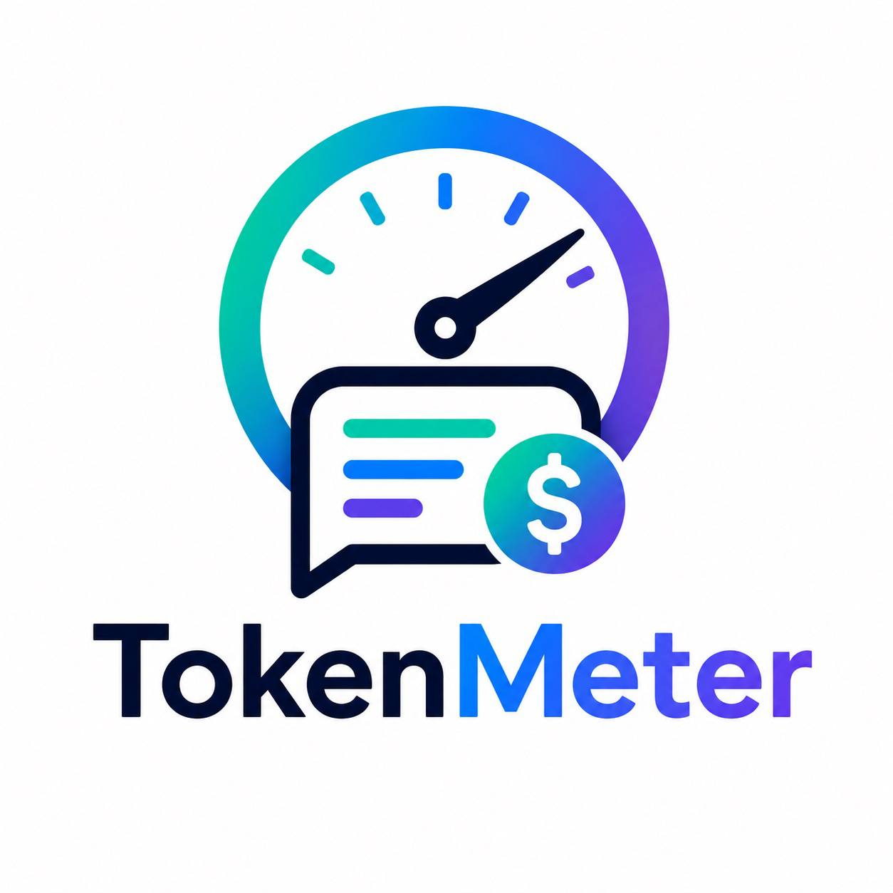

 

<h1 align="center">TokenMeter</h1>

 Calcula cuánto habría costado generar un repositorio completo usando IA.

 
 
 
 
 

---

TokenMeter analiza repositorios públicos de GitHub, estima la cantidad de tokens y calcula el coste mínimo de generación basado en los precios de los tokens de salida de modelos de IA.

> [!IMPORTANT]
> Este cálculo no incluye tokens de entrada, prompts, contexto, intentos fallidos, razonamiento ni llamadas a herramientas.
>
> Es el suelo, no el techo.

---

# 🚀 Características

| Característica | Descripción |
|---|---|
| 🌍 Repos públicos GitHub | Analiza cualquier repositorio público simplemente con su URL |
| 📄 Conteo de tokens | Estimación aproximada de tokens por archivo y repositorio |
| 💸 Coste mínimo | Calcula el coste usando precios reales de salida |
| 📊 Modos realistas | Estimación para workflows asistidos y agentic |
| 📈 Desglose detallado | Por lenguaje, extensión, carpeta y archivos |
| 🔗 Reportes públicos | Comparte resultados mediante URL |
| 🛠 Open Source | Proyecto transparente y extensible |
| 🗄 Histórico | Guarda y compara análisis |
| ⚙️ Precios configurables | Soporte para distintos modelos |

---

# 🧠 Modos de estimación

| Modo | Descripción | Multiplicador |
|---|---|---|
| 🟢 Mínimo | Solo tokens finales del repositorio | x1 |
| 🔵 Asistido | IA + ayuda humana + iteraciones moderadas | x3 |
| 🟣 Agentic | Agente IA itera, corrige, prueba y reescribe | x8 |
| 🔴 Agente caótico | Mucho contexto, pruebas, errores y vueltas | x15 |

---

# ⚙️ Cómo funciona
1. Recibe URL del repositorio
2. Clona el repositorio temporalmente
3. Filtra archivos relevantes
4. Cuenta tokens por archivo
5. Calcula costes según modelo
6. Genera reporte público

---

# 🏗 Arquitectura
React (Frontend)
 ↕
Spring Boot (API)
 ↕
 PostgreSQL (DB)
 ↕
 Jobs / Analysis Engine
 ↕
Filesystem (Repos temporales)

---

# 💻 Stack tecnológico

## Backend

- Java 21
- Spring Boot 3
- Gradle Kotlin DSL
- PostgreSQL
- Flyway
- Docker

## Frontend

- React
- Vite
- TailwindCSS

## Infraestructura

- Docker Compose
- Nginx
- Let's Encrypt
- Cloudflare DNS

---

# 📂 Arquitectura backend
backend/
├── domain/
├── application/
└── infrastructure/

## Domain

Lógica de negocio principal.

## Application

Casos de uso y orquestación.

## Infrastructure

Persistencia, GitHub, filesystem y REST APIs.

---

# 📁 Estructura del proyecto
tokenmeter/
├── backend/
│ ├── domain/
│ ├── application/
│ ├── infrastructure/
│ └── build.gradle.kts
│
├── frontend/
│ ├── src/
│ └── package.json
│
├── docs/
│ └── assets/
│ └── tokenmeter-logo.png
│
├── docker/
├── docker-compose.yml
└── README.md

---

# 📄 Archivos incluidos

TokenMeter analiza archivos de texto relevantes:
.java
.kt
.js
.ts
.tsx
.jsx
.py
.go
.rs
.md
.yml
.yaml
.json
.xml
.sql
.html
.css
.scss
Dockerfile
.properties
.gradle
.kts
.toml

---

# 🚫 Archivos excluidos
.git/
node_modules/
target/
build/
dist/
.gradle/
.idea/
.vscode/
coverage/

*.png
*.jpg
*.jpeg
*.gif
*.webp
*.jar
*.zip
*.tar
*.gz
*.pdf
*.min.js
*.map

Lockfiles podrán excluirse opcionalmente.

---

# 🔢 Fórmula de cálculo
coste = output_tokens * precio_por_1M / 1_000_000

Ejemplo:
850.000 tokens
GPT-5.3 Codex → $14 / 1M tokens

= $11.90

---

# 🧮 Estrategia de tokenización MVP

Inicialmente:
tokens ≈ caracteres / 4

Más adelante se integrarán tokenizers reales por modelo.

---

# 🌐 API

## Crear análisis
POST /api/analyses

Request:
{
 "repositoryUrl": "https://github.com/user/repo"
}

---

## Obtener análisisGET /api/analyses/{id}

---

## Obtener archivos analizados
GET /api/analyses/{id}/files

---

## Obtener precios
GET /api/models/pricing

---

## Reporte público
GET /reports/{id}

---

# ▶️ Ejecución rápida (desarrollo)

## Requisitos

- Java 21+
- Node.js 22+
- Docker & Docker Compose
- Git

---

## Backend
cd backend
./gradlew bootRun

---

## Frontend
cd frontend
npm install
npm run dev

---

## Docker Compose
docker compose up --build

---

# 🌍 Servicios

| Servicio | URL |
|---|---|
| Frontend | http://localhost:5173 |
| Backend API | http://localhost:8080 |
| PostgreSQL | localhost:5432 |

---

# 🔐 Variables de entorno
SPRING_PROFILES_ACTIVE=local

POSTGRES_DB=tokenmeter
POSTGRES_USER=tokenmeter
POSTGRES_PASSWORD=tokenmeter

TOKENMETER_WORKDIR=/tmp/tokenmeter
TOKENMETER_PUBLIC_BASE_URL=http://localhost:5173
TOKENMETER_USD_EUR_RATE=0.92

---

# 🐳 Docker Compose (ejemplo)
services:

 tokenmeter-api:
 build:
 context: ./backend

 ports:
 - "8080:8080"

 environment:
 SPRING_PROFILES_ACTIVE: docker
 SPRING_DATASOURCE_URL: jdbc:postgresql://tokenmeter-db:5432/tokenmeter
 SPRING_DATASOURCE_USERNAME: tokenmeter
 SPRING_DATASOURCE_PASSWORD: tokenmeter

 depends_on:
 - tokenmeter-db

 tokenmeter-web:
 build:
 context: ./frontend

 ports:
 - "5173:80"

 depends_on:
 - tokenmeter-api

 tokenmeter-db:
 image: postgres:16

 environment:
 POSTGRES_DB: tokenmeter
 POSTGRES_USER: tokenmeter
 POSTGRES_PASSWORD: tokenmeter

---

# 🚀 Despliegue producción

Dominio previsto:
https://tokenmeter.backendtothefuture.com

Nginx:
server {

 server_name tokenmeter.backendtothefuture.com;

 location / {
 proxy_pass http://localhost:5173;
 }

 location /api/ {
 proxy_pass http://localhost:8080;
 }
}

---

# 🛣 Roadmap

## MVP

- [ ] Backend Spring Boot
- [ ] Frontend React
- [ ] PostgreSQL + Flyway
- [ ] Clonado de repos públicos
- [ ] Conteo de tokens
- [ ] Estimación de costes
- [ ] Reportes públicos
- [ ] Docker Compose

## Futuro

- [ ] Tokenizers reales
- [ ] GitHub Action
- [ ] Badge README
- [ ] Comparación entre ramas
- [ ] Histórico de repositorios
- [ ] Leaderboards
- [ ] GitHub App para repos privados
- [ ] Exportación CSV/JSON
- [ ] API pública

---

# 💡 Filosofía

TokenMeter intenta responder una pregunta simple:

> “¿Cuál es el coste mínimo de este repositorio como salida de IA?”

No pretende ser contabilidad exacta.

Pretende dar:

- perspectiva
- curiosidad
- transparencia
- conversación

Porque algunos repositorios cuestan más emocionalmente que económicamente.

---

# 📜 Licencia

MIT

---

# 🚧 Estado

MVP en desarrollo activo.

Contribuciones, ideas y experimentos son bienvenidos.
