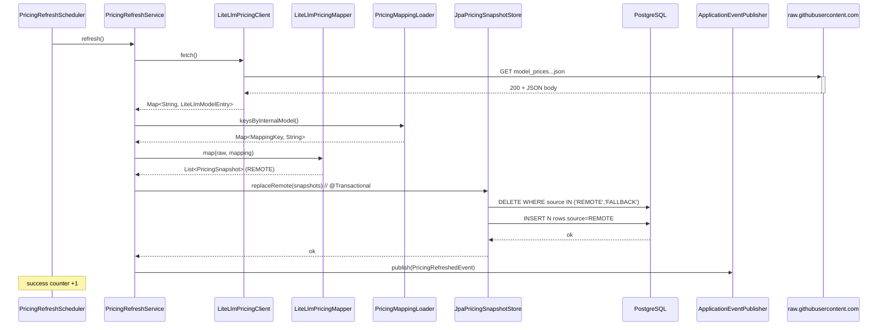

# Architecture

## Visión

TokenMeter responde a una pregunta: **"¿Cuál sería el coste mínimo de generar este repositorio con IA?"** El sistema clona un repositorio público de GitHub, escanea archivos relevantes, cuenta tokens con un encoder real y multiplica por precios reales de varios modelos bajo tres modos de uso (`RAW`, `ASSISTED`, `AGENTIC`).

## Diagrama de alto nivel

```
┌──────────────┐       HTTP/JSON       ┌──────────────────────────────┐
│  React SPA   │  ───────────────────▶ │     Spring Boot REST API     │
│  Vite :3000  │                       │            :8080             │
└──────────────┘                       └──────────────┬───────────────┘
                                                      │
                            ┌─────────────────────────┼──────────────────────────┐
                            │                         │                          │
                            ▼                         ▼                          ▼
                  ┌──────────────────┐     ┌────────────────────┐    ┌─────────────────────┐
                  │   PostgreSQL     │     │  Filesystem (tmp)  │    │  pricing.yaml       │
                  │   18 + Flyway    │     │  clones git CLI       │    │  (classpath)        │
                  └──────────────────┘     └────────────────────┘    └─────────────────────┘
```

Todo el stack se despliega con `docker compose up --build -d`.

## Backend: arquitectura hexagonal

```
backend/src/main/java/dev/diegobarrioh/tokenmeter/
├── TokenMeterBackendApplication.java
├── domain/                      ← núcleo, sin frameworks
│   ├── analyzer/                  RepositoryFileMetric, LanguageStatistics, RepositoryScanResult
│   ├── cost/                      CostEstimationMode, ModelCostEstimate
│   ├── pricing/                   AiProvider, ModelPricing
│   ├── repository/                GitHubRepositoryUrl, RepositoryCloneSummary, RepositoryIntakeException
│   └── tokenizer/                 FileTokenMetrics, LanguageTokenMetrics, RepositoryTokenizationResult
├── application/                 ← casos de uso
│   ├── analyzer/                  RepositoryAnalysisService, RepositoryFileScanner, BinaryFileDetector,
│   │                              FileLanguageDetector, AnalysisPersistenceService (port)
│   ├── cost/                      RepositoryCostEstimationService
│   ├── pricing/                   PricingProvider (port), PricingNotFoundException
│   ├── repository/                RepositoryIntakeService, GitRepositoryCloner (port),
│   │                              RepositorySizeCalculator, RepositoryIntakeProperties
│   └── tokenizer/                 RepositoryTokenizationService, OpenAiTokenCounter
└── infrastructure/              ← adapters
    ├── git/                       GitCliRepositoryCloner            implements GitRepositoryCloner
    ├── pricing/                   YamlPricingProvider             implements PricingProvider
    ├── persistence/analysis/      JpaAnalysisPersistenceService   implements AnalysisPersistenceService
    │                              + AnalysisEntity / LanguageStatsEntity / CostEstimateEntity
    └── web/
        ├── HealthController
        ├── analyzer/              RepositoryAnalysisController + DTOs + mappers
        ├── pricing/               PricingController + DTOs
        └── repository/            RepositoryIntakeController + ExceptionHandler + DTOs
```

### Dependencias entre capas

```
infrastructure ──▶ application ──▶ domain
```

`domain` no conoce a `application` ni a `infrastructure`. `application` define **ports** (interfaces) que `infrastructure` implementa con tecnologías concretas (git CLI, JPA, Jackson YAML).

### Ports (interfaces) e implementaciones

| Port (`application` o `domain`) | Adapter (`infrastructure`) |
|---|---|
| `application.repository.GitRepositoryCloner` | `infrastructure.git.GitCliRepositoryCloner` |
| `application.pricing.PricingProvider` | `infrastructure.pricing.YamlPricingProvider` |
| `application.analyzer.AnalysisPersistenceService` | `infrastructure.persistence.analysis.JpaAnalysisPersistenceService` |

## Flujo: `POST /api/analyze`

```
RepositoryAnalysisController.analyze(req)
  └─▶ RepositoryAnalysisService.analyze(rawUrl)
        ├─ GitHubRepositoryUrl.parse(rawUrl)              ← validación dominio
        ├─ Files.createTempDirectory(...)
        ├─ cloneWithTimeout()                             ← ExecutorService + Future.get(timeout)
        │     └─ GitCliRepositoryCloner.clone(...)
        ├─ RepositorySizeCalculator.summarize(dir)
        ├─ enforceSizeLimit(summary)                      ← REPOSITORY_TOO_LARGE
        ├─ RepositoryFileScanner.scan(dir)
        │     ├─ ignora .git, node_modules, target, build, dist, coverage
        │     ├─ BinaryFileDetector.isBinary
        │     ├─ FileLanguageDetector.detect
        │     └─ countLines(file) UTF-8
        ├─ RepositoryTokenizationService.tokenize(dir, scan)
        │     └─ OpenAiTokenCounter.count(text)           ← jtokkit O200K_BASE
        ├─ RepositoryCostEstimationService.estimate(totalTokens)
        │     └─ N modelos × {RAW, ASSISTED, AGENTIC}
        ├─ JpaAnalysisPersistenceService.save(...)
        │     └─ analysis + language_stats + cost_estimates
        └─ finally: deleteRecursively(tempDir)
```

Errores se modelan con `RepositoryIntakeException(errorCode, message)` y se mapean a HTTP status en `RepositoryIntakeExceptionHandler`:

| `RepositoryIntakeErrorCode` | HTTP |
|---|---|
| `INVALID_URL` | 400 |
| `REPOSITORY_NOT_ACCESSIBLE` | 404 |
| `REPOSITORY_TOO_LARGE` | 413 |
| `CLONE_TIMEOUT` | 504 |
| `CLONE_FAILED` | 502 |
| `AnalysisNotFoundException` | 404 (`ANALYSIS_NOT_FOUND`) |
| `MethodArgumentNotValidException` | 400 (`INVALID_URL`) |

## Modelo de datos

```sql
-- V1__baseline.sql
app_metadata (id, metadata_key UNIQUE, metadata_value, created_at)

-- V2__analysis_persistence.sql
analysis (
  id UUID PK,
  repository_url, clone_url, owner_name, repository_name,
  status, total_files, total_lines, total_bytes,
  token_encoding, total_tokens, created_at
)
language_stats (
  id BIGSERIAL PK,
  analysis_id UUID FK → analysis(id) ON DELETE CASCADE,
  language_name, files, lines, bytes, tokens,
  UNIQUE (analysis_id, language_name)
)

-- V3__analysis_cost_estimates.sql
cost_estimates (
  id BIGSERIAL PK,
  analysis_id UUID FK → analysis(id) ON DELETE CASCADE,
  provider, model, mode,
  base_tokens, estimated_input_tokens, estimated_output_tokens,
  input_cost NUMERIC(20,6), output_cost NUMERIC(20,6), total_cost NUMERIC(20,6),
  formula TEXT,
  UNIQUE (analysis_id, provider, model, mode)
)
```

`spring.jpa.hibernate.ddl-auto=validate` en todos los perfiles. Schema lo gestiona Flyway, no Hibernate.

## Modos de estimación

`domain/cost/CostEstimationMode`:

| Modo | output × base | input × base | Interpretación |
|---|---|---|---|
| `RAW` | 1 | 0 | Solo el output final del repo. Suelo absoluto. |
| `ASSISTED` | 5 | 1 | Iteraciones humanas, prompts, correcciones. |
| `AGENTIC` | 20 | 4 | Loop autónomo con razonamiento y tool overhead. |

Fórmula: `inputCost = baseTokens × inputMul × inputPricePerMillion / 1_000_000`, idem `outputCost`. `totalCost = inputCost + outputCost`, redondeo `HALF_UP` a 6 decimales. `formula` se serializa en cada `cost_estimates.formula`.

## Tokenización

`OpenAiTokenCounter` envuelve `jtokkit` con `EncodingType.O200K_BASE` (compatible con `gpt-4o`/`gpt-4o-mini`/`o1`). El nombre de encoding (`o200k_base`) se persiste en `analysis.token_encoding` para trazabilidad.

Limitación conocida: se usa el encoder OpenAI para estimar tokens también con modelos Anthropic, Google y DeepSeek. Es una aproximación; los tokenizers reales por proveedor están en el roadmap.

## Pricing

`backend/src/main/resources/pricing.yaml` se carga vía `YamlPricingProvider` (Jackson YAML) en startup. Estructura:

```yaml
pricing:
  models:
    - provider: openai
      model: gpt-4o
      input-token-price: 2.50      # USD por millón de tokens
      output-token-price: 10.00
```

`AiProvider` enum mantiene la lista cerrada de providers soportados (`openai`, `anthropic`, `google`, `deepseek`, `mistral`, `alibaba`, `xai`).

## Pricing pipeline (dynamic refresh)

Desde el cambio `dynamic-pricing-fetch`, el provider efectivo es un **composite de tres capas** que se evalúa en tiempo de lectura. El resultado se sirve a `RepositoryCostEstimationService` y a `GET /api/pricing`.

### Capas y precedencia

```
┌────────────────────────────────────────────────────────────┐
│  OVERRIDE  (pricing-overrides.yaml — opcional, in-memory)  │  ← gana siempre
├────────────────────────────────────────────────────────────┤
│  REMOTE    (model_pricing rows con source='REMOTE')         │  ← LiteLLM refresh
├────────────────────────────────────────────────────────────┤
│  FALLBACK  (model_pricing rows con source='FALLBACK')       │  ← seed YAML
└────────────────────────────────────────────────────────────┘
```

`CompositePricingProvider` (`@Component @Primary`) carga las filas persistidas vía `JpaPricingSnapshotStore.findAll()`, mergea OVERRIDE en un `LinkedHashMap<(provider, model), PricingSnapshot>` y devuelve la lista ordenada ascendente por `provider.configKey()` y luego por `model`. OVERRIDE nunca se persiste — vive sólo como capa de lectura.

### Tabla `model_pricing`

Migración `V5__model_pricing_snapshot.sql`. Columnas:

- `id` (BIGINT IDENTITY, PK)
- `provider` (`VARCHAR(64)`) — `AiProvider.configKey()`
- `model` (`VARCHAR(128)`)
- `input_price_per_million`, `output_price_per_million` (`NUMERIC(12,6)`, no negativos)
- `source` (`VARCHAR(16)` con `CHECK IN ('REMOTE','FALLBACK','OVERRIDE')`)
- `fetched_at` (`TIMESTAMP WITH TIME ZONE`, UTC)
- `external_model_id` (`VARCHAR(255)`, nullable — clave LiteLLM)
- `deprecated_at` (`TIMESTAMP WITH TIME ZONE`, nullable — reservado v2)

Unique constraint `uq_model_pricing_provider_model (provider, model)` provee el índice B-tree que cubre lookups y el `ORDER BY` del controller. Detalle completo en `openspec/changes/dynamic-pricing-fetch/design.md §2.1`.

### Secuencia de refresh

`PricingRefreshScheduler` (`@Scheduled`, condicional sobre `tokenmeter.pricing.refresh.enabled`) y `POST /api/admin/pricing/refresh` comparten la misma orquestación en `PricingRefreshService`:



Si `fetch()` o `map()` lanzan `PricingFetchException`, la transacción nunca se abre — las filas previas sobreviven y se incrementa `tokenmeter_pricing_refresh_failure_total`. El scheduler se traga la excepción para no detener el cron semanal.

### Cold-start

En arranque sobre una BBDD vacía, `FallbackSeedRunner` (`ApplicationRunner`) inserta 17 filas con `source=FALLBACK` desde el YAML semilla. El boot **nunca depende del remoto**: el endpoint `/api/pricing` responde 200 con `primarySource=fallback` y `lastRefreshedAt=null` hasta que la primera refresh REMOTE complete.

### Rollback y operativa

Disable rápido: `tokenmeter.pricing.refresh.enabled=false`. Rollback completo: ver `openspec/changes/dynamic-pricing-fetch/design.md §10` y `docs/RUNBOOK.md`. Métricas Prometheus expuestas: `tokenmeter_pricing_refresh_success_total`, `tokenmeter_pricing_refresh_failure_total`, `tokenmeter_pricing_refresh_last_success_timestamp_seconds`.

## Frontend

Vite + React SPA mínima:

```
frontend/src/
├── main.tsx
├── App.tsx                    AppShell + DashboardPage
├── components/AppShell.tsx
├── pages/DashboardPage.tsx    formulario URL → POST /api/analyze → render resultados
├── services/api.ts            fetch wrappers + ApiError
├── types/api.ts               DTOs espejo del backend
└── hooks/useAsync.ts
```

El proxy de Vite (`vite.config.ts`) reenvía `/api/*` a `http://localhost:8080`, así que el frontend en dev no necesita CORS.

## CI/CD

`.github/workflows/ci.yml`:

| Job | Steps |
|---|---|
| `backend` | `setup-java@21` (cache gradle) → `./gradlew clean check --no-daemon` |
| `frontend` | `setup-node@22` → `npm ci` → `npm run lint` → `npm run build` |
| `sonarcloud` | depende de `backend` + `frontend` → `./gradlew sonar` (skip si `SONAR_TOKEN` ausente) |

## Decisiones clave

1. **Hexagonal con tres paquetes**, no DDD pleno. Suficiente para el tamaño actual; evita over-engineering.
2. **`git` CLI en lugar de JGit**. Más rápido y más parecido al comportamiento real de GitHub para clones shallow; requiere binario `git` en runtime.
3. **jtokkit (encoder OpenAI) para todos los modelos**. Aproximación pragmática; mejor un suelo razonable hoy que vaporware multi-tokenizer.
4. **Postgres + Flyway desde el día 1**. `ddl-auto=validate` para que Hibernate nunca toque el schema.
5. **Sin caché de análisis** (todavía). Cada `POST /api/analyze` clona de nuevo. Suficiente mientras `max-repository-bytes` esté en 300 MiB.
6. **Persistencia síncrona dentro del request**. No hay job queue. Para repos grandes, el cliente espera. Si crece, mover a flujo async + polling con `analysis.status`.
7. **Filesystem temporal**. Clones se borran en `finally`; no se cachean entre requests.
8. **3 modos hardcoded** (`RAW`/`ASSISTED`/`AGENTIC`). Multiplicadores son la ABI del cálculo: cambiarlos invalida estimaciones históricas. Si fueran configurables, persistirlos en `cost_estimates.formula` (ya se hace).

## Roadmap arquitectónico

- Tokenizers reales por proveedor (Anthropic, Google).
- Job queue async para repos grandes (Spring Batch o Quartz + tabla `analysis_job`).
- Cache de análisis por `(repository_url, commit_sha)`.
- API key + rate limiting para uso público.
- Multi-tenant si se ofrece como SaaS.
