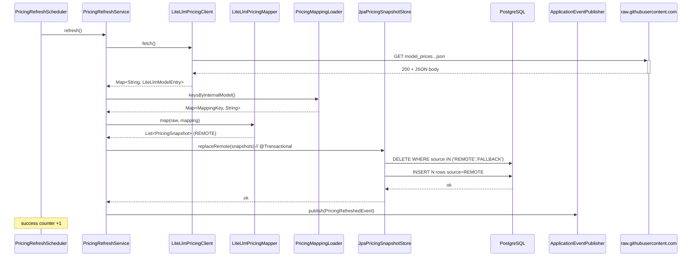

# Architecture

## Visión

TokenMeter responde a una pregunta: **"¿Cuál sería el coste mínimo de generar este repositorio con IA?"** El sistema clona un repositorio público de GitHub, escanea archivos relevantes, cuenta tokens con un encoder real y multiplica por precios reales de varios modelos bajo tres modos de uso (`RAW`, `ASSISTED`, `AGENTIC`).

## Diagrama de alto nivel

```
┌──────────────┐       HTTP/JSON       ┌──────────────────────────────┐
│  React SPA   │  ───────────────────▶ │     Spring Boot REST API     │
│  Vite :3000  │                       │            :8080             │
└──────────────┘                       └──────────────┬───────────────┘
                                                      │
                            ┌─────────────────────────┼──────────────────────────┐
                            │                         │                          │
                            ▼                         ▼                          ▼
                  ┌──────────────────┐     ┌────────────────────┐    ┌─────────────────────┐
                  │   PostgreSQL     │     │  Filesystem (tmp)  │    │  pricing.yaml       │
                  │   18 + Flyway    │     │  clones git CLI       │    │  (classpath)        │
                  └──────────────────┘     └────────────────────┘    └─────────────────────┘
```

Todo el stack se despliega con `docker compose up --build -d`.

## Backend: arquitectura hexagonal

```
backend/src/main/java/dev/diegobarrioh/tokenmeter/
├── TokenMeterBackendApplication.java
├── domain/                      ← núcleo, sin frameworks
│   ├── analyzer/                  RepositoryFileMetric, LanguageStatistics, RepositoryScanResult
│   ├── cost/                      CostEstimationMode, ModelCostEstimate
│   ├── job/                       AnalysisJobId, AnalysisJobStatus, AnalysisJobPhase,
│   │                              AnalysisJobErrorCode, AnalysisJobMetrics, AnalysisJobSnapshot
│   ├── pricing/                   AiProvider, ModelPricing
│   ├── repository/                GitHubRepositoryUrl, RepositoryCloneSummary, RepositoryIntakeException
│   └── tokenizer/                 FileTokenMetrics, LanguageTokenMetrics, RepositoryTokenizationResult
├── application/                 ← casos de uso
│   ├── analyzer/                  RepositoryAnalysisService, RepositoryFileScanner, BinaryFileDetector,
│   │                              FileLanguageDetector, AnalysisPersistenceService (port),
│   │                              AnalysisJobSubmissionService, AnalysisJobExecutionService,
│   │                              AnalysisJobQueryService, AnalysisJobRepository (port),
│   │                              AnalysisJobProgressEmitter (port), AnalysisJobReaper,
│   │                              AnalysisJobRetentionScheduler, MdcScope
│   ├── cost/                      RepositoryCostEstimationService
│   ├── pricing/                   PricingProvider (port), PricingNotFoundException
│   ├── repository/                RepositoryIntakeService, GitRepositoryCloner (port),
│   │                              RepositorySizeCalculator, RepositoryIntakeProperties
│   └── tokenizer/                 RepositoryTokenizationService, OpenAiTokenCounter
└── infrastructure/              ← adapters
    ├── config/                    AsyncExecutionConfig (@EnableAsync @EnableScheduling,
    │                              analysisJobExecutor bean)
    ├── git/                       GitCliRepositoryCloner            implements GitRepositoryCloner
    ├── pricing/                   YamlPricingProvider             implements PricingProvider
    ├── persistence/analysis/      JpaAnalysisPersistenceService   implements AnalysisPersistenceService
    │                              + AnalysisEntity / LanguageStatsEntity / CostEstimateEntity
    │   └── jobs/                  AnalysisJobEntity, AnalysisJobJpaRepository,
    │                              JpaAnalysisJobRepository, JpaAnalysisJobProgressEmitter
    └── web/
        ├── HealthController
        ├── analyzer/              RepositoryAnalysisController + AnalysisJobController + DTOs + mappers
        ├── pricing/               PricingController + DTOs
        └── repository/            RepositoryIntakeController + ExceptionHandler + DTOs
```

### Dependencias entre capas

```
infrastructure ──▶ application ──▶ domain
```

`domain` no conoce a `application` ni a `infrastructure`. `application` define **ports** (interfaces) que `infrastructure` implementa con tecnologías concretas (git CLI, JPA, Jackson YAML).

### Ports (interfaces) e implementaciones

| Port (`application` o `domain`) | Adapter (`infrastructure`) |
|---|---|
| `application.repository.GitRepositoryCloner` | `infrastructure.git.GitCliRepositoryCloner` |
| `application.pricing.PricingProvider` | `infrastructure.pricing.YamlPricingProvider` |
| `application.analyzer.AnalysisPersistenceService` | `infrastructure.persistence.analysis.JpaAnalysisPersistenceService` |
| `application.analyzer.AnalysisJobRepository` | `infrastructure.persistence.analysis.jobs.JpaAnalysisJobRepository` |
| `application.analyzer.AnalysisJobProgressEmitter` | `infrastructure.persistence.analysis.jobs.JpaAnalysisJobProgressEmitter` |

## Flujo: `POST /api/analyze` (asíncrono, jobs observables)

Desde el cambio `observable-analysis-jobs`, `POST /api/analyze` es un **submission endpoint asíncrono**: persiste un job en `QUEUED`, lo entrega al executor `analysisJobExecutor` y devuelve `202` en < 100 ms. La pipeline real corre en `AnalysisJobExecutionService` (`@Async`) y emite progreso vía un emitter transaccional. El cliente pollea `GET /api/analyze/jobs/{jobId}`. El contrato HTTP completo vive en [`docs/API.md`](API.md).

```
HTTP POST /api/analyze (hilo Servlet, < 100 ms)
  └─▶ AnalysisJobController.submit(req)
        ├─ GitHubRepositoryUrl.parse(rawUrl)              ← 400 INVALID_URL si falla
        └─▶ AnalysisJobSubmissionService.submit(url)
              ├─ AnalysisJobRepository.save(QUEUED snapshot)  [tx CREATE]
              ├─ analysisJobExecutor.execute(() -> executionService.runJob(jobId))
              │     └─ RejectedExecutionException → repo.deleteById(jobId) + 429 RATE_LIMITED
              └─ returns AnalysisJobSnapshot { status=QUEUED }
        └─ 202 { jobId, status:"QUEUED", statusUrl, analysisId:null }

analysisJobExecutor (thread tm-job-N)
  └─▶ AnalysisJobExecutionService.runJob(jobId)
        │  emitter.transition(QUEUED → CHECKING_CACHE)     [REQUIRES_NEW]
        │  emitter.transition(... → CLONING_REPOSITORY)
        ├─ Files.createTempDirectory(...)
        ├─ GitCliRepositoryCloner.clone(...)              ← CLONE_TIMEOUT / CLONE_FAILED
        │  emitter.transition(... → SCANNING_FILES)
        ├─ RepositorySizeCalculator.summarize + enforceSizeLimit  ← REPOSITORY_TOO_LARGE
        │  emitter.transition(... → FILTERING_FILES)
        ├─ RepositoryFileScanner.scan(dir)
        │  emitter.updateMetrics(filesDiscovered, filesSkipped, ...)
        │  emitter.transition(... → COUNTING_TOKENS)
        ├─ RepositoryTokenizationService.tokenize(dir, scan)
        │     └─ OpenAiTokenCounter.count(text)           ← jtokkit O200K_BASE
        │  emitter.updateMetrics(tokensCounted, filesProcessed)
        │  emitter.transition(... → CALCULATING_COSTS)
        ├─ RepositoryCostEstimationService.estimate(totalTokens)
        │     └─ N modelos × {RAW, ASSISTED, AGENTIC}
        │  emitter.transition(... → SAVING_REPORT)
        ├─ JpaAnalysisPersistenceService.save(...)
        │     └─ analysis + language_stats + cost_estimates
        │  emitter.success(jobId, analysisId, finalMetrics)  ← progress=100, status=SUCCESS, phase=COMPLETED
        ├─ catch RepositoryIntakeException e → emitter.fail(fromIntakeCode(e), e.message)
        ├─ catch Throwable t                 → emitter.fail(ANALYSIS_FAILED, t.message)
        └─ finally: deleteRecursively(tempDir)

HTTP GET /api/analyze/jobs/{jobId}
  └─▶ AnalysisJobController.getJob(jobId)
        └─▶ AnalysisJobQueryService.getView(jobId)
              ├─ JpaAnalysisJobRepository.findById → AnalysisJobSnapshot
              └─ if !terminal: countByStatus(RUNNING) + countQueuedAheadOf(jobId) → AnalysisJobQueueState
        ├─ 200 { jobId, status, phase, phaseLabel, progressPercent, message, analysisId, error?, metrics, timestamps, queueState? }
        └─ 404 JOB_NOT_FOUND
```

`AnalysisJobController` está fuera del `AnalyzeRateLimitInterceptor` (`excludePathPatterns("/api/analyze/jobs/**", ...)`) — el polling no genera 429. El interceptor sólo se aplica a `POST /api/analyze`.

### Lifecycle del job

```
        ┌──────────┐  executor.execute   ┌──────────┐  emitter.success  ┌──────────┐
POST →  │  QUEUED  │ ─────────────────▶ │ RUNNING  │ ─────────────────▶ │ SUCCESS  │
        └────┬─────┘                     └────┬─────┘                   └──────────┘
             │ executor rejection              │ emitter.fail
             │     (cola+pool llenos)          ▼
             ▼                            ┌──────────┐
       429 RATE_LIMITED                   │  FAILED  │  ←── ApplicationRunner reaper en boot
       (job no se persiste)               └──────────┘     marca FAILED + JOB_INTERRUPTED
```

`status` (`QUEUED|RUNNING|SUCCESS|FAILED`) viaja en paralelo a `phase`, que es el detalle observable para el cliente. Las fases canónicas (forward-only):

| Phase | Descripción |
|---|---|
| `QUEUED` | Job persistido, esperando worker. |
| `CHECKING_CACHE` | Reservado para fast-path de cache (no-op por ahora). |
| `CLONING_REPOSITORY` | `git clone --depth=1`. |
| `SCANNING_FILES` | Walk del filesystem temp + filtros de ignore. |
| `FILTERING_FILES` | `BinaryFileDetector` + detección de lenguaje. |
| `COUNTING_TOKENS` | Tokenización jtokkit por archivo. |
| `CALCULATING_COSTS` | `N modelos × 3 modos`. |
| `SAVING_REPORT` | Persiste `analysis` + `language_stats` + `cost_estimates`. |
| `COMPLETED` | Terminal (acompaña `status=SUCCESS`). |
| `FAILED` | Terminal (acompaña `status=FAILED`). |

Saltos hacia adelante son legales si una fase es no-op. Cualquier fase no terminal puede saltar a `FAILED`. Las fases terminales son inmutables (`canTransitionTo` lo rechaza).

### Componentes

| Componente | Tipo | Responsabilidad |
|---|---|---|
| `AnalysisJobController` | `@RestController` | `POST /api/analyze` y `GET /api/analyze/jobs/{jobId}`. |
| `AnalysisJobSubmissionService` | `@Service` | Valida URL, persiste `QUEUED`, entrega al executor. Mapea `RejectedExecutionException` (techo de cola) a 429 con mensaje `"Analysis queue is full"`. |
| `AnalysisJobExecutionService` | `@Service` con `@Async("analysisJobExecutor")` | Orquesta la pipeline y emite progreso. |
| `AnalysisJobQueryService` | `@Service` (read-only) | `findById` (snapshot puro) y `getView` (snapshot + `queueState` on-read para no terminales). |
| `AnalysisJobProgressEmitter` | port + `JpaAnalysisJobProgressEmitter` adapter | Cada emit en `@Transactional(REQUIRES_NEW)` para que el GET poll vea cambios. Clamp `progress ∈ [0..99]` excepto en `success` (único punto que pone 100). `fail` es idempotente. |
| `AnalysisJobRepository` | port + `JpaAnalysisJobRepository` adapter | CRUD sobre `analysis_job` + queries del reaper/retention. |
| `AnalysisJobReaper` | `ApplicationRunner` | Al boot reconcilia jobs no terminales heredados → `FAILED/JOB_INTERRUPTED`. |
| `AnalysisJobRetentionScheduler` | `@Scheduled` | Purga jobs `SUCCESS` > 7 días y `FAILED` > 30 días (cron `0 30 3 * * *` por defecto). |

### Executor y configuración

`infrastructure/config/AsyncExecutionConfig` (`@Configuration @EnableAsync @EnableScheduling`) publica el bean `analysisJobExecutor` con:

- `corePoolSize = maxPoolSize = tokenmeter.analyze-throttle.max-concurrent` (default 3)
- `queueCapacity = tokenmeter.analyze-throttle.queue-capacity` (default 256)
- `threadNamePrefix = "tm-job-"`
- `RejectedExecutionHandler = AbortPolicy` → propaga `RejectedExecutionException` **sólo** cuando el `LinkedBlockingQueue` alcanza `queueCapacity`. La saturación de slots con cola libre **no** dispara `AbortPolicy`: el job queda encolado. El submission service mapea la `RejectedExecutionException` residual a `RepositoryIntakeException(RATE_LIMITED)` con mensaje `"Analysis queue is full"`.
- `waitForTasksToCompleteOnShutdown = true`, `awaitTerminationSeconds = 30`.

#### Concurrency cap y queue state

Desde el cambio `concurrent-analysis-limits`, la cola interna del executor actúa como una **cola FIFO observable** y el techo de slots ya no devuelve `429`:

- `tokenmeter.analyze-throttle.max-concurrent` fija el número máximo de jobs simultáneos en `status = RUNNING`. El invariante `countByStatus(RUNNING) <= maxConcurrent` se mantiene en todo wall-clock instant.
- `tokenmeter.analyze-throttle.queue-capacity` (default `256`) es el techo del `LinkedBlockingQueue`. Sobrepasarlo es la única ruta a `429 RATE_LIMITED` desde la saturación del executor (el otro motivo de `429` sigue siendo el rate limiter por IP).
- Promoción FIFO al liberarse un slot: el `ThreadPoolExecutor` despacha la siguiente tarea encolada; `SUCCESS` y `FAILED` liberan slot por igual.
- `AnalysisJobQueryService.getView(jobId)` calcula `queueState` on-read sobre `analysis_job` vía `countByStatus(RUNNING)` + `countQueuedAheadOf(jobId)` (índice `idx_analysis_job_status_created_at` introducido por V7). `queueState` es `null` para jobs terminales y `queuePosition` es `null` para `RUNNING`.
- `AnalysisJobResponseMapper` deriva `phaseLabel = "Waiting for an analysis slot"` cuando `status = QUEUED && runningCount >= maxConcurrency`; en otro caso mantiene `"Queued"`.

Variables de entorno asociadas: `TOKENMETER_ANALYZE_QUEUE_CAPACITY`, `TOKENMETER_JOB_RETENTION_SUCCESS` (`Duration`, default `P7D`), `TOKENMETER_JOB_RETENTION_FAILED` (default `P30D`), `TOKENMETER_JOB_RETENTION_CRON`.

> Que `AsyncExecutionConfig` y `PricingSchedulingConfig` activen ambos `@EnableScheduling` no genera conflictos: Spring deduplica al fusionar metadata de varias `@Configuration`.

### Mapeo de errores

`RepositoryIntakeException(errorCode, message)` se mapea a HTTP en `RepositoryIntakeExceptionHandler`. Bajo el flujo asíncrono, sólo dos códigos viajan como HTTP desde `POST /api/analyze`; el resto se materializan en `error.code` del body del job:

| `RepositoryIntakeErrorCode` | HTTP en POST | Aparición típica en `job.error.code` |
|---|---|---|
| `INVALID_URL` | 400 | `INVALID_URL` (también puede llegar como job FAILED si la validación tardía falla) |
| `RATE_LIMITED` | 429 | — |
| `REPOSITORY_TOO_LARGE` | — | `REPOSITORY_TOO_LARGE` |
| `CLONE_TIMEOUT` | — | `CLONE_TIMEOUT` |
| `CLONE_FAILED` | — | `ANALYSIS_FAILED` (folded) |
| `REPOSITORY_NOT_ACCESSIBLE` | — | `ANALYSIS_FAILED` (folded) |

Otros mappings de excepciones del handler:

| Excepción | HTTP |
|---|---|
| `AnalysisNotFoundException` | 404 (`ANALYSIS_NOT_FOUND`) |
| `AnalysisJobNotFoundException` | 404 (`JOB_NOT_FOUND`) |
| `MethodArgumentNotValidException` | 400 (`INVALID_URL`) |
| `MethodArgumentTypeMismatchException` | 400 (`INVALID_REQUEST`) |

`AnalysisJobErrorCode.JOB_INTERRUPTED` no aparece como código HTTP: vive solo dentro del job tras la reconciliación del reaper.

## Modelo de datos

```sql
-- V1__baseline.sql
app_metadata (id, metadata_key UNIQUE, metadata_value, created_at)

-- V2__analysis_persistence.sql
analysis (
  id UUID PK,
  repository_url, clone_url, owner_name, repository_name,
  status, total_files, total_lines, total_bytes,
  token_encoding, total_tokens, created_at
)
language_stats (
  id BIGSERIAL PK,
  analysis_id UUID FK → analysis(id) ON DELETE CASCADE,
  language_name, files, lines, bytes, tokens,
  UNIQUE (analysis_id, language_name)
)

-- V3__analysis_cost_estimates.sql
cost_estimates (
  id BIGSERIAL PK,
  analysis_id UUID FK → analysis(id) ON DELETE CASCADE,
  provider, model, mode,
  base_tokens, estimated_input_tokens, estimated_output_tokens,
  input_cost NUMERIC(20,6), output_cost NUMERIC(20,6), total_cost NUMERIC(20,6),
  formula TEXT,
  UNIQUE (analysis_id, provider, model, mode)
)

-- V6__analysis_job.sql
analysis_job (
  id UUID PK,
  status VARCHAR(16) CHECK IN ('QUEUED','RUNNING','SUCCESS','FAILED'),
  phase VARCHAR(32) CHECK IN ('QUEUED','CHECKING_CACHE','CLONING_REPOSITORY','SCANNING_FILES',
                              'FILTERING_FILES','COUNTING_TOKENS','CALCULATING_COSTS',
                              'SAVING_REPORT','COMPLETED','FAILED'),
  progress_percent SMALLINT CHECK (0 <= progress_percent <= 100),
  message TEXT,
  analysis_id UUID FK → analysis(id) ON DELETE RESTRICT,
  error_code VARCHAR(32), error_message TEXT,
  files_discovered BIGINT, files_processed BIGINT, files_skipped BIGINT,
  tokens_counted BIGINT, context_windows INT, pricing_models_processed INT,
  created_at, started_at, updated_at, completed_at,
  -- invariantes:
  CHECK (progress_percent <= 99 OR (status='SUCCESS' AND analysis_id IS NOT NULL)),
  CHECK (files_processed IS NULL OR files_discovered IS NULL OR files_processed <= files_discovered),
  CHECK ((status IN ('SUCCESS','FAILED')) = (completed_at IS NOT NULL)),
  CHECK (status <> 'FAILED' OR (error_code IS NOT NULL AND error_message IS NOT NULL))
)
-- índices: idx_analysis_job_status, idx_analysis_job_completed_at, idx_analysis_job_created_at
```

`spring.jpa.hibernate.ddl-auto=validate` en todos los perfiles. Schema lo gestiona Flyway, no Hibernate.

## Modos de estimación

`domain/cost/CostEstimationMode`:

| Modo | output × base | input × base | Interpretación |
|---|---|---|---|
| `RAW` | 1 | 0 | Solo el output final del repo. Suelo absoluto. |
| `ASSISTED` | 5 | 1 | Iteraciones humanas, prompts, correcciones. |
| `AGENTIC` | 20 | 4 | Loop autónomo con razonamiento y tool overhead. |

Fórmula: `inputCost = baseTokens × inputMul × inputPricePerMillion / 1_000_000`, idem `outputCost`. `totalCost = inputCost + outputCost`, redondeo `HALF_UP` a 6 decimales. `formula` se serializa en cada `cost_estimates.formula`.

## Tokenización

`OpenAiTokenCounter` envuelve `jtokkit` con `EncodingType.O200K_BASE` (compatible con `gpt-4o`/`gpt-4o-mini`/`o1`). El nombre de encoding (`o200k_base`) se persiste en `analysis.token_encoding` para trazabilidad.

Limitación conocida: se usa el encoder OpenAI para estimar tokens también con modelos Anthropic, Google y DeepSeek. Es una aproximación; los tokenizers reales por proveedor están en el roadmap.

## Pricing

`backend/src/main/resources/pricing.yaml` se carga vía `YamlPricingProvider` (Jackson YAML) en startup. Estructura:

```yaml
pricing:
  models:
    - provider: openai
      model: gpt-4o
      input-token-price: 2.50      # USD por millón de tokens
      output-token-price: 10.00
```

`AiProvider` enum mantiene la lista cerrada de providers soportados (`openai`, `anthropic`, `google`, `deepseek`, `mistral`, `alibaba`, `xai`).

## Pricing pipeline (dynamic refresh)

Desde el cambio `dynamic-pricing-fetch`, el provider efectivo es un **composite de tres capas** que se evalúa en tiempo de lectura. El resultado se sirve a `RepositoryCostEstimationService` y a `GET /api/pricing`.

### Capas y precedencia

```
┌────────────────────────────────────────────────────────────┐
│  OVERRIDE  (pricing-overrides.yaml — opcional, in-memory)  │  ← gana siempre
├────────────────────────────────────────────────────────────┤
│  REMOTE    (model_pricing rows con source='REMOTE')         │  ← LiteLLM refresh
├────────────────────────────────────────────────────────────┤
│  FALLBACK  (model_pricing rows con source='FALLBACK')       │  ← seed YAML
└────────────────────────────────────────────────────────────┘
```

`CompositePricingProvider` (`@Component @Primary`) carga las filas persistidas vía `JpaPricingSnapshotStore.findAll()`, mergea OVERRIDE en un `LinkedHashMap<(provider, model), PricingSnapshot>` y devuelve la lista ordenada ascendente por `provider.configKey()` y luego por `model`. OVERRIDE nunca se persiste — vive sólo como capa de lectura.

### Tabla `model_pricing`

Migración `V5__model_pricing_snapshot.sql`. Columnas:

- `id` (BIGINT IDENTITY, PK)
- `provider` (`VARCHAR(64)`) — `AiProvider.configKey()`
- `model` (`VARCHAR(128)`)
- `input_price_per_million`, `output_price_per_million` (`NUMERIC(12,6)`, no negativos)
- `source` (`VARCHAR(16)` con `CHECK IN ('REMOTE','FALLBACK','OVERRIDE')`)
- `fetched_at` (`TIMESTAMP WITH TIME ZONE`, UTC)
- `external_model_id` (`VARCHAR(255)`, nullable — clave LiteLLM)
- `deprecated_at` (`TIMESTAMP WITH TIME ZONE`, nullable — reservado v2)

Unique constraint `uq_model_pricing_provider_model (provider, model)` provee el índice B-tree que cubre lookups y el `ORDER BY` del controller. Detalle completo en `openspec/changes/dynamic-pricing-fetch/design.md §2.1`.

### Secuencia de refresh

`PricingRefreshScheduler` (`@Scheduled`, condicional sobre `tokenmeter.pricing.refresh.enabled`) y `POST /api/admin/pricing/refresh` comparten la misma orquestación en `PricingRefreshService`:



Si `fetch()` o `map()` lanzan `PricingFetchException`, la transacción nunca se abre — las filas previas sobreviven y se incrementa `tokenmeter_pricing_refresh_failure_total`. El scheduler se traga la excepción para no detener el cron semanal.

### Cold-start

En arranque sobre una BBDD vacía, `FallbackSeedRunner` (`ApplicationRunner`) inserta 17 filas con `source=FALLBACK` desde el YAML semilla. El boot **nunca depende del remoto**: el endpoint `/api/pricing` responde 200 con `primarySource=fallback` y `lastRefreshedAt=null` hasta que la primera refresh REMOTE complete.

### Rollback y operativa

Disable rápido: `tokenmeter.pricing.refresh.enabled=false`. Rollback completo: ver `openspec/changes/dynamic-pricing-fetch/design.md §10` y `docs/RUNBOOK.md`. Métricas Prometheus expuestas: `tokenmeter_pricing_refresh_success_total`, `tokenmeter_pricing_refresh_failure_total`, `tokenmeter_pricing_refresh_last_success_timestamp_seconds`.

## Frontend

Vite + React SPA mínima:

```
frontend/src/
├── main.tsx
├── App.tsx                       AppShell + DashboardPage
├── components/AppShell.tsx
├── pages/DashboardPage.tsx       formulario URL → POST /api/analyze → polling job → render resultados
├── services/api.ts               fetch wrappers + ApiError; submitAnalysis() devuelve AnalysisJobAcceptedResponse
├── types/api.ts                  DTOs espejo del backend (incluye AnalysisJobStatusResponse)
├── hooks/useAsync.ts
├── hooks/useAnalysisJob.ts       polling con setTimeout encadenado + AbortController; detiene en SUCCESS/FAILED/404
└── utils/analysisJobProgress.ts  mapping JobPhase → stageIndex (0..7) + clamp visual a 99/100
```

Tests con Vitest + RTL + jsdom (`frontend/src/test/setup.ts`, `frontend/vitest.config.ts`). Script `npm run test` (= `vitest run`).

El proxy de Vite (`vite.config.ts`) reenvía `/api/*` a `http://localhost:8080`, así que el frontend en dev no necesita CORS.

## CI/CD

`.github/workflows/ci.yml`:

| Job | Steps |
|---|---|
| `backend` | `setup-java@21` (cache gradle) → `./gradlew clean check --no-daemon` |
| `frontend` | `setup-node@22` → `npm ci` → `npm run lint` → `npm run build` |
| `sonarcloud` | depende de `backend` + `frontend` → `./gradlew sonar` (skip si `SONAR_TOKEN` ausente) |

## Decisiones clave

1. **Hexagonal con tres paquetes**, no DDD pleno. Suficiente para el tamaño actual; evita over-engineering.
2. **`git` CLI en lugar de JGit**. Más rápido y más parecido al comportamiento real de GitHub para clones shallow; requiere binario `git` en runtime.
3. **jtokkit (encoder OpenAI) para todos los modelos**. Aproximación pragmática; mejor un suelo razonable hoy que vaporware multi-tokenizer.
4. **Postgres + Flyway desde el día 1**. `ddl-auto=validate` para que Hibernate nunca toque el schema.
5. **Sin caché de análisis** (todavía). Cada `POST /api/analyze` clona de nuevo. Suficiente mientras `max-repository-bytes` esté en 300 MiB.
6. **Submission asíncrono con polling** (cambio `observable-analysis-jobs`). `POST /api/analyze` persiste un job `QUEUED`, lo entrega a un `ThreadPoolTaskExecutor` (`analysisJobExecutor`, `core=max=tokenmeter.analyze-throttle.max-concurrent`, `queueCapacity=32`) y devuelve `202`. La pipeline corre en `AnalysisJobExecutionService` (`@Async`) y publica progreso a `analysis_job` mediante un emitter `REQUIRES_NEW`. El cliente pollea `GET /api/analyze/jobs/{jobId}` cada 1.5 s. Reaper al boot + retention scheduler completan el ciclo de vida.
7. **Filesystem temporal**. Clones se borran en `finally`; no se cachean entre requests.
8. **3 modos hardcoded** (`RAW`/`ASSISTED`/`AGENTIC`). Multiplicadores son la ABI del cálculo: cambiarlos invalida estimaciones históricas. Si fueran configurables, persistirlos en `cost_estimates.formula` (ya se hace).

## Roadmap arquitectónico

- Tokenizers reales por proveedor (Anthropic, Google).
- ~~Job queue async para repos grandes~~ — implementado en `observable-analysis-jobs` (`ThreadPoolTaskExecutor` + tabla `analysis_job`); siguiente iteración: outbox / multi-nodo con `SELECT FOR UPDATE SKIP LOCKED`.
- Cache de análisis por `(repository_url, commit_sha)` — activable vía la fase `CHECKING_CACHE`, hoy no-op.
- API key + rate limiting para uso público.
- Multi-tenant si se ofrece como SaaS.
