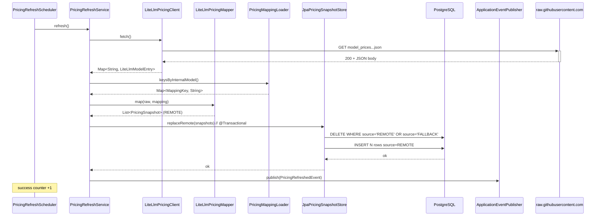
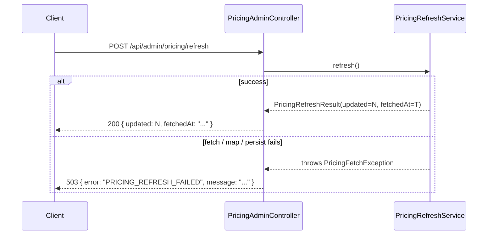

# Design: Dynamic Pricing Fetch

> Skill note — the orchestrator-supplied SKILL.md sets a 800-word ceiling for `design.md`, but the launch prompt for this phase explicitly overrides that with a 500–900-line target. Following the launch prompt (more specific instruction wins).

## Technical Approach

Replace the single static `YamlPricingProvider @Primary` bean with a three-layer **CompositePricingProvider** that merges, in priority order, an optional in-memory override map, a JPA-backed `model_pricing` snapshot, and the YAML fallback seed. Pricing is **refreshed asynchronously** by `PricingRefreshService` from the public LiteLLM JSON catalogue, mapped through an explicit `pricing-mapping.yaml`, and written transactionally to the `model_pricing` table. The application **never blocks boot on the remote**: an `ApplicationRunner` seeds the table from YAML if empty, the scheduler is opt-in, and refresh failures preserve previous rows.

Hexagonal boundaries are preserved:

- `domain/pricing` gains a `PricingSource` enum and a new value object `PricingSnapshot` (wraps `ModelPricing` + freshness metadata) — no Spring / JPA imports.
- `application/pricing` keeps the existing `PricingProvider` port (extended only with a default `lastRefreshedAt()` method that returns `Optional.empty()`).
- `application/pricing/refresh` hosts `PricingRefreshService` (orchestration, no HTTP / JPA types in signature).
- `infrastructure/pricing/*` and `infrastructure/persistence/pricing/*` hold the adapters: REST client, mappers, JPA entity/repo, snapshot store.

The implementation MUST satisfy the spec scenarios (cold-start seed, successful refresh, refresh failure, override precedence, response shape, regression-free cost estimation).

---

## 1. Architecture Overview

### 1.1 Component diagram

```mermaid
flowchart LR
  subgraph Frontend
    UI[ModelsPage.tsx]
  end

  subgraph Web [infrastructure/web]
    PCtl[PricingController<br/>GET /api/pricing]
    ACtl[PricingAdminController<br/>POST /api/admin/pricing/refresh]
  end

  subgraph App [application]
    Provider[(PricingProvider port)]
    Refresh[PricingRefreshService]
    CostSvc[RepositoryCostEstimationService]
  end

  subgraph Domain [domain]
    AiP[AiProvider enum<br/>+MISTRAL +ALIBABA +XAI]
    MP[ModelPricing record]
    Snap[PricingSnapshot record]
    Src[PricingSource enum<br/>OVERRIDE/REMOTE/FALLBACK]
  end

  subgraph Infra [infrastructure/pricing]
    Comp[CompositePricingProvider<br/>@Primary]
    Over[OverridesPricingLoader]
    Map[PricingMappingLoader]
    Lite[LiteLlmPricingClient<br/>Spring RestClient]
    LiteMap[LiteLlmPricingMapper]
    YamlSeed[YamlPricingProvider<br/>repurposed as FallbackSeedSource]
    Seeder[FallbackSeedRunner<br/>ApplicationRunner]
    Sched[PricingRefreshScheduler<br/>@Scheduled / @ConditionalOnProperty]
  end

  subgraph Persistence [infrastructure/persistence/pricing]
    Repo[ModelPricingJpaRepository]
    Entity[ModelPricingEntity]
    Store[JpaPricingSnapshotStore]
  end

  subgraph External
    Litellm[(raw.githubusercontent.com<br/>BerriAI/litellm JSON)]
    DB[(PostgreSQL<br/>model_pricing table)]
  end

  UI -->|HTTP| PCtl
  UI -->|HTTP| ACtl
  PCtl --> Provider
  ACtl --> Refresh
  CostSvc --> Provider
  Provider -.implements.-> Comp
  Comp --> Over
  Comp --> Store
  Comp --> YamlSeed
  Refresh --> Lite
  Refresh --> LiteMap
  Refresh --> Store
  Refresh --> Map
  Sched --> Refresh
  Seeder --> Store
  Seeder --> YamlSeed
  Lite --> Litellm
  Store --> Repo
  Repo --> Entity
  Entity --> DB
```

### 1.2 Bean wiring notes

| Bean | Class | Stereotype | Notes |
|------|-------|------------|-------|
| `pricingProvider` | `CompositePricingProvider` | `@Component @Primary` | Injected into `RepositoryCostEstimationService` and `PricingController`. Replaces the existing `@Primary` |
| `fallbackSeedSource` | `YamlPricingProvider` | `@Component("fallbackSeedSource")` (no `@Primary`) | Same class; remove `@Service`, add an explicit bean name. Still implements `PricingProvider` (so it can be passed where the port is expected by tests), but only `CompositePricingProvider` is injected via the port type into production beans |
| `pricingMappingLoader` | `PricingMappingLoader` | `@Component` | Loads `pricing-mapping.yaml` eagerly at startup |
| `overridesPricingLoader` | `OverridesPricingLoader` | `@Component` | Loads `pricing-overrides.yaml` if present; otherwise exposes empty map |
| `liteLlmPricingClient` | `LiteLlmPricingClient` | `@Component` | Owns a single `RestClient` instance configured via `RestClient.Builder` |
| `liteLlmPricingMapper` | `LiteLlmPricingMapper` | `@Component` | Pure transformation; depends on `PricingMappingLoader` |
| `jpaPricingSnapshotStore` | `JpaPricingSnapshotStore` | `@Service` | Transactional upsert / replace operations |
| `pricingRefreshService` | `PricingRefreshService` | `@Service` | Orchestrates fetch → map → store; depends on the three above. Publishes `PricingRefreshedEvent` via `ApplicationEventPublisher` |
| `pricingRefreshScheduler` | `PricingRefreshScheduler` | `@Component @ConditionalOnProperty("tokenmeter.pricing.refresh.enabled", havingValue="true")` | Thin `@Scheduled` wrapper |
| `fallbackSeedRunner` | `FallbackSeedRunner` | `@Component` (implements `ApplicationRunner`) | Seeds `model_pricing` from YAML when table empty |
| `pricingAdminController` | `PricingAdminController` | `@RestController @ConditionalOnProperty("tokenmeter.pricing.admin.enabled", havingValue="true", matchIfMissing=true)` | Calls `pricingRefreshService.refresh()` synchronously and returns the resulting snapshot count |

`@EnableScheduling` is declared on a **dedicated** `@Configuration` class `PricingSchedulingConfig` annotated `@ConditionalOnProperty("tokenmeter.pricing.refresh.enabled", havingValue="true")`. See §7.2 for rationale.

---

## 2. Data Model

### 2.1 New table `model_pricing`

```sql
-- V5__model_pricing_snapshot.sql
CREATE TABLE model_pricing (
    id                          BIGINT GENERATED ALWAYS AS IDENTITY PRIMARY KEY,
    provider                    VARCHAR(64)     NOT NULL,
    model                       VARCHAR(128)    NOT NULL,
    input_price_per_million     NUMERIC(12, 6)  NOT NULL,
    output_price_per_million    NUMERIC(12, 6)  NOT NULL,
    source                      VARCHAR(16)     NOT NULL,
    fetched_at                  TIMESTAMP WITH TIME ZONE NOT NULL,
    external_model_id           VARCHAR(255),
    deprecated_at               TIMESTAMP WITH TIME ZONE,
    CONSTRAINT uq_model_pricing_provider_model UNIQUE (provider, model),
    CONSTRAINT ck_model_pricing_input_nonneg   CHECK (input_price_per_million >= 0),
    CONSTRAINT ck_model_pricing_output_nonneg  CHECK (output_price_per_million >= 0),
    CONSTRAINT ck_model_pricing_source         CHECK (source IN ('REMOTE','FALLBACK','OVERRIDE'))
);
```

| Column | Type | Notes |
|--------|------|-------|
| `id` | `BIGINT GENERATED ALWAYS AS IDENTITY` | Portable identity. PostgreSQL 18 supports it natively; H2 2.x (used in `application.yml` test) supports it with `MODE=PostgreSQL`. Avoids `gen_random_uuid()` (not in H2 by default) and keeps the same `BIGINT` ergonomics as `analysis.id` |
| `provider` | `VARCHAR(64)` | Stores `AiProvider.configKey()` — same convention as `cost_estimates.provider` (see `CostEstimateEntity`). NOT enforced as FK because the enum lives in domain code, not DB |
| `model` | `VARCHAR(128)` | Trimmed; case sensitivity follows the rest of the codebase (`YamlPricingProvider` normalizes lower-case at read time) |
| `input_price_per_million`, `output_price_per_million` | `NUMERIC(12,6)` | 6 decimal places matches `cost_estimates.total_cost`. Max value ~999,999.999999 USD/M tokens — generous |
| `source` | `VARCHAR(16)` | Maps to `PricingSource` enum via `@Enumerated(STRING)`. CHECK constraint enforces the three values |
| `fetched_at` | `TIMESTAMP WITH TIME ZONE` | Always UTC. Set by application code (not DB default) so seed and remote rows share semantics |
| `external_model_id` | `VARCHAR(255)`, nullable | The LiteLLM key (`litellm_provider/model`) for traceability. Null for FALLBACK and OVERRIDE rows |
| `deprecated_at` | `TIMESTAMP WITH TIME ZONE`, nullable | Future-proofs deprecation surfacing. v1 only writes from LiteLLM's `deprecation_date` if present; UI does not yet consume it |

#### 2.1.1 Indexes

No additional indexes in v1.

Rationale: `UNIQUE (provider, model)` already provides a B-tree index that covers `find(provider, model)` and the `ORDER BY provider, model` query the controller uses. The table size is bounded (≤ ~50 rows by Tier 1+2 catalogue), so additional secondary indexes would only add write cost without read benefit. If the table grows beyond ~1000 rows, add `idx_model_pricing_source` in a follow-up migration.

#### 2.1.2 Flyway / H2 compatibility

- `BIGINT GENERATED ALWAYS AS IDENTITY` — ANSI SQL standard. H2 2.2+ and PostgreSQL 10+ both support it. The codebase already runs Flyway against H2 in tests (see `backend/src/test/resources/application.yml` line `flyway.enabled: true`).
- `TIMESTAMP WITH TIME ZONE` — supported by both.
- `NUMERIC(12,6)` — supported by both.
- `CHECK (... IN ('REMOTE','FALLBACK','OVERRIDE'))` — supported by both.
- No PostgreSQL-only features (no `jsonb`, no `gen_random_uuid()`, no extensions, no `text` without length).

#### 2.1.3 Migration ordering risk

`V4__leaderboard_indexes.sql` is the highest applied version. New file MUST be `V5__model_pricing_snapshot.sql`. The migration ships in **the same commit** as `ModelPricingEntity` so that `ddl-auto: validate` cannot fail in any intermediate state. No data migration is required — the runtime seed loader handles backfill.

### 2.2 JPA entity `ModelPricingEntity`

```java
package dev.diegobarrioh.tokenmeter.infrastructure.persistence.pricing;

import dev.diegobarrioh.tokenmeter.domain.pricing.PricingSource;
import jakarta.persistence.*;
import java.math.BigDecimal;
import java.time.OffsetDateTime;

@Entity
@Table(
    name = "model_pricing",
    uniqueConstraints = @UniqueConstraint(name = "uq_model_pricing_provider_model",
        columnNames = {"provider", "model"}))
public class ModelPricingEntity {
  @Id
  @GeneratedValue(strategy = GenerationType.IDENTITY)
  private Long id;

  @Column(nullable = false, length = 64)  private String provider;
  @Column(nullable = false, length = 128) private String model;
  @Column(name = "input_price_per_million",  nullable = false, precision = 12, scale = 6) private BigDecimal inputPricePerMillion;
  @Column(name = "output_price_per_million", nullable = false, precision = 12, scale = 6) private BigDecimal outputPricePerMillion;
  @Enumerated(EnumType.STRING)
  @Column(nullable = false, length = 16)  private PricingSource source;
  @Column(name = "fetched_at", nullable = false) private OffsetDateTime fetchedAt;
  @Column(name = "external_model_id", length = 255) private String externalModelId;
  @Column(name = "deprecated_at") private OffsetDateTime deprecatedAt;

  protected ModelPricingEntity() {}  // JPA
  // explicit all-args constructor + getters; no setters except for id (managed by JPA)
}
```

- `provider` is stored as the `AiProvider.configKey()` string, NOT as a JPA enum, mirroring `CostEstimateEntity` which uses `@Enumerated(STRING)` on `AiProvider` directly. We deviate from that pattern here on purpose: storing the lowercase config key keeps the snapshot table compatible if the enum is renamed without a data migration, AND it matches the wire format used by `PricingController`. The mapping happens once at the repository boundary (`JpaPricingSnapshotStore`).
- `source` IS stored via `@Enumerated(STRING)` because the three values are stable in domain code and the column is `VARCHAR(16) NOT NULL CHECK ... IN (...)` — schema enforces the contract.

### 2.3 Repository

```java
public interface ModelPricingJpaRepository extends JpaRepository<ModelPricingEntity, Long> {
  Optional<ModelPricingEntity> findByProviderAndModel(String provider, String model);
  long count();
  List<ModelPricingEntity> findAllByOrderByProviderAscModelAsc();
}
```

---

## 3. Domain Changes

### 3.1 `ModelPricing` and the new `PricingSnapshot`

**Decision**: introduce a new `PricingSnapshot` record that **wraps** `ModelPricing`. Do NOT modify the existing `ModelPricing` record.

```java
package dev.diegobarrioh.tokenmeter.domain.pricing;

import java.time.OffsetDateTime;
import java.util.Objects;

public record PricingSnapshot(
    ModelPricing pricing,
    PricingSource source,
    OffsetDateTime fetchedAt,
    String externalModelId) {  // null for FALLBACK / OVERRIDE
  public PricingSnapshot {
    Objects.requireNonNull(pricing, "pricing is required");
    Objects.requireNonNull(source, "source is required");
    Objects.requireNonNull(fetchedAt, "fetchedAt is required");
  }
  public AiProvider provider() { return pricing.provider(); }
  public String model() { return pricing.model(); }
}
```

**Alternatives considered**:

| Option | Pros | Cons |
|--------|------|------|
| A. Extend `ModelPricing` record with `source` + `fetchedAt` | Single type | Breaks the canonical positional constructor used in **6 production+test files** (`RepositoryCostEstimationService` indirect, `RepositoryAnalysisControllerTest`, `RepositoryCostEstimationServiceTest`, `RepositoryAnalysisServiceTest`, `PricingControllerTest`, `JpaAnalysisPersistenceServiceTest`, `EngineeringEffortEstimatorTest`, `YamlPricingProviderTest`, `ModelPricingTest`). Every `new ModelPricing(provider, model, in, out)` must be rewritten — pollutes the diff and breaks the spec's "no regression in `RepositoryCostEstimationService` output for identical input prices" guarantee at the test level (test signatures change even if behavior doesn't) |
| B. **Wrap in `PricingSnapshot`** (chosen) | Zero breakage to existing record. `RepositoryCostEstimationService` keeps consuming `ModelPricing` (port returns `List<ModelPricing>`). Freshness metadata flows via a separate port method (`snapshots()`) used only by `PricingController` and admin tooling | One more type; controller needs to call two methods (`snapshots()` for the wire response, `all()` is implicitly satisfied by adapting snapshots → pricings) |

We collapse this asymmetry by:

1. Adding **`List<PricingSnapshot> snapshots()`** to `PricingProvider`.
2. Keeping `List<ModelPricing> all()` as a default method:
   ```java
   default List<ModelPricing> all() {
     return snapshots().stream().map(PricingSnapshot::pricing).toList();
   }
   ```
3. Existing implementations (`YamlPricingProvider` after rename) override `snapshots()` to wrap each entry with `source=FALLBACK`, `fetchedAt=Instant.now()` captured once at construction.

### 3.2 New enum `PricingSource`

```java
package dev.diegobarrioh.tokenmeter.domain.pricing;
public enum PricingSource { OVERRIDE, REMOTE, FALLBACK }
```

Order in the file mirrors precedence (OVERRIDE wins). Wire format uses `name()` — uppercase.

### 3.3 `AiProvider` enum extension

Add `MISTRAL`, `ALIBABA`, `XAI`. Verified usages:

| Usage | Risk | Action |
|-------|------|--------|
| `AiProvider.values()` iteration | `AiProvider.fromConfigKey` (linear scan) — no impact, still O(n) | None |
| Exhaustive switches | `grep -rn "switch.*provider\|case OPENAI\|case ANTHROPIC\|case GOOGLE\|case DEEPSEEK" backend/src frontend/src` returns **zero matches**. No exhaustive switches anywhere | None |
| `@Enumerated(STRING)` on `CostEstimateEntity.provider` | New enum values round-trip as strings; existing rows are unaffected | None |
| Frontend `providerBadgeCls` map | Lookup uses `?? 'border-text/20 ...'` fallback (line 99 of `ModelsPage.tsx`). Unknown providers degrade gracefully | Add three entries for visual consistency (out of scope for backend design) |
| Tests using `AiProvider.OPENAI` etc. | Existing values unchanged | None |

**No exhaustive-switch refactor needed.** The enum extension is safe.

---

## 4. External Integration

### 4.1 `LiteLlmPricingClient`

```java
@Component
public class LiteLlmPricingClient {
  private final RestClient restClient;
  private final URI sourceUrl;

  public LiteLlmPricingClient(
      RestClient.Builder builder,
      @Value("${tokenmeter.pricing.litellm.url:https://raw.githubusercontent.com/BerriAI/litellm/main/model_prices_and_context_window.json}")
      URI sourceUrl,
      @Value("${tokenmeter.pricing.litellm.timeout:10s}") Duration timeout) {
    this.sourceUrl = sourceUrl;
    this.restClient = builder
        .requestFactory(new SimpleClientHttpRequestFactory() {{
          setConnectTimeout((int) timeout.toMillis());
          setReadTimeout((int) timeout.toMillis());
        }})
        .defaultHeader("Accept", "application/json")
        .defaultHeader("User-Agent", "tokenmeter/1.0 (+https://github.com/diegobarrioh/tokenmeter)")
        .build();
  }

  public Map<String, LiteLlmModelEntry> fetch() {
    try {
      Map<String, LiteLlmModelEntry> body = restClient.get()
          .uri(sourceUrl)
          .retrieve()
          .body(new ParameterizedTypeReference<>() {});
      if (body == null || body.isEmpty()) {
        throw new PricingFetchException("LiteLLM payload was empty");
      }
      return body;
    } catch (RestClientException ex) {
      throw new PricingFetchException("Failed to fetch LiteLLM pricing", ex);
    }
  }
}
```

| Aspect | Choice | Rationale |
|--------|--------|-----------|
| HTTP client | Spring `RestClient` (Boot 3.5) | Already on classpath via `spring-boot-starter-web`. Synchronous, fits `@Scheduled` thread model. No reactive deps |
| Timeout | `tokenmeter.pricing.litellm.timeout=10s` (default) | LiteLLM JSON is ~600KB; 10s allows for slow GitHub CDN. Connect + read both bounded |
| Failure mode | Throws `PricingFetchException` (new `infrastructure/pricing/PricingFetchException`, RuntimeException) | Caller (`PricingRefreshService`) catches and logs WARN, increments failure metric, leaves DB untouched |
| Auth | None | GitHub raw is 60 req/h unauth; weekly cron uses 1/week — well under quota |
| JSON parsing | Jackson with `@JsonIgnoreProperties(ignoreUnknown = true)` | LiteLLM has ~30 fields per model; we read 4. Skip-unknown protects against upstream additions |

### 4.2 `LiteLlmModelEntry` DTO

```java
@JsonIgnoreProperties(ignoreUnknown = true)
record LiteLlmModelEntry(
    @JsonProperty("input_cost_per_token")  BigDecimal inputCostPerToken,
    @JsonProperty("output_cost_per_token") BigDecimal outputCostPerToken,
    @JsonProperty("litellm_provider")      String litellmProvider,
    @JsonProperty("deprecation_date")      String deprecationDate  // ISO-8601 string, parsed lazily
) {}
```

Located in `infrastructure/pricing/litellm/LiteLlmModelEntry.java` (package-private record).

### 4.3 Conversion to `pricePerMillion`

```java
static final BigDecimal ONE_MILLION = new BigDecimal("1000000");

BigDecimal pricePerMillion(BigDecimal costPerToken) {
  return costPerToken.multiply(ONE_MILLION).setScale(6, RoundingMode.HALF_UP);
}
```

`BigDecimal` exclusively — never `double`. Scale 6 matches `NUMERIC(12,6)` and the existing `cost_estimates.total_cost` convention.

### 4.4 Top-level JSON shape

The LiteLLM file is a JSON **object** keyed by model name. The first entry, `sample_spec`, MUST be skipped. Mapper logic:

```java
for (var entry : raw.entrySet()) {
  if ("sample_spec".equals(entry.getKey())) continue;
  LiteLlmModelEntry e = entry.getValue();
  if (e.inputCostPerToken() == null || e.outputCostPerToken() == null) continue;
  // ... lookup in mapping, build ModelPricing
}
```

---

## 5. Mapping + Overrides

### 5.1 `pricing-mapping.yaml`

```yaml
# backend/src/main/resources/pricing-mapping.yaml
mapping:
  - provider: anthropic
    model: claude-opus-4-7
    litellm-key: claude-opus-4-7
  - provider: anthropic
    model: claude-sonnet-4-6
    litellm-key: claude-sonnet-4-6
  - provider: openai
    model: gpt-4o
    litellm-key: gpt-4o
  - provider: alibaba
    model: qwen3-coder
    litellm-key: qwen/qwen3-coder
  # ... 17 entries total (see exploration.md table)
```

`PricingMappingLoader` parses this at startup into an immutable `Map<MappingKey, String>` where `MappingKey` is `record MappingKey(AiProvider provider, String normalizedModel)`. Same normalization as `YamlPricingProvider.normalizeModel` (trim + lower-case).

**Missing-key behavior**: when `LiteLlmPricingMapper` encounters an internal `(provider, model)` not present in `pricing-mapping.yaml`, it logs `WARN: no LiteLLM mapping configured for {provider}:{model}` and skips that row. Pre-existing DB row stays. When the LiteLLM JSON does not contain a key referenced in `pricing-mapping.yaml`, log `WARN: LiteLLM key not found: {key}`, increment counter, skip.

### 5.2 `pricing-overrides.yaml` (optional)

```yaml
# backend/src/main/resources/pricing-overrides.yaml  (optional)
overrides:
  - provider: anthropic
    model: claude-opus-4-7
    input-token-price: 12.00       # negotiated rate
    output-token-price: 60.00
```

`OverridesPricingLoader` uses `Resource.exists()` guard (same pattern as `YamlPricingProvider.load`) and returns an empty map if missing. The file is **not packaged** by default — it lives at `src/main/resources/pricing-overrides.yaml` if a deployer wishes; the more typical deployment pattern uses an external location via `tokenmeter.pricing.overrides-location` config.

### 5.3 Precedence

```
OVERRIDE  >  REMOTE  >  FALLBACK
```

`CompositePricingProvider.snapshots()` algorithm:

```
result = new LinkedHashMap<(provider, model), PricingSnapshot>()

// 1. Seed FALLBACK rows last in priority — added first, then overwritten
for snap in jpaSnapshotStore.findAll(): result.put(key(snap), snap)
   // store returns OVERRIDE rows tagged from snapshots; in this design we only
   // persist REMOTE/FALLBACK to DB and merge OVERRIDE in-memory at read-time

// 2. Apply OVERRIDE in-memory
for snap in overridesPricingLoader.snapshots(): result.put(key(snap), snap)

return result.values().stream().sorted(byProviderThenModel).toList()
```

Note: OVERRIDE is **read-time only**, never persisted. This keeps the override file as the single source of truth without DB drift.

---

## 6. Sequence Diagrams

### 6.1 Cold-start boot

```mermaid
sequenceDiagram
  participant Boot as Spring Boot
  participant FW as Flyway
  participant DB as PostgreSQL
  participant Seeder as FallbackSeedRunner
  participant Yaml as YamlPricingProvider
  participant Store as JpaPricingSnapshotStore

  Boot->>FW: migrate()
  FW->>DB: apply V1..V5 (creates model_pricing)
  DB-->>FW: ok
  Boot->>Boot: context refresh complete
  Boot->>Seeder: run(ApplicationArguments)
  Seeder->>Store: count()
  Store->>DB: SELECT COUNT(*) FROM model_pricing
  DB-->>Store: 0
  Store-->>Seeder: 0
  Seeder->>Yaml: snapshots()  // returns 17 FALLBACK snapshots
  Yaml-->>Seeder: List<PricingSnapshot>
  Seeder->>Store: replaceAll(snapshots)
  Store->>DB: INSERT 17 rows (source=FALLBACK)
  DB-->>Store: ok
  Note over Boot: app ready; no remote call performed
```

### 6.2 Scheduled refresh



Failure path: if `fetch()` or `map()` throws, the transaction never opens. Existing rows survive. Failure counter +1. WARN log with exception.

### 6.3 `GET /api/pricing` request

```mermaid
sequenceDiagram
  participant FE as Frontend (ModelsPage)
  participant Ctl as PricingController
  participant Comp as CompositePricingProvider
  participant Store as JpaPricingSnapshotStore
  participant Over as OverridesPricingLoader
  participant DB as PostgreSQL

  FE->>Ctl: GET /api/pricing
  Ctl->>Comp: snapshots()
  Comp->>Store: findAll()
  Store->>DB: SELECT * FROM model_pricing ORDER BY provider, model
  DB-->>Store: rows
  Store-->>Comp: List<PricingSnapshot> (REMOTE + FALLBACK)
  Comp->>Over: snapshots()
  Over-->>Comp: List<PricingSnapshot> (OVERRIDE)
  Comp->>Comp: merge by (provider, model); OVERRIDE wins
  Comp-->>Ctl: List<PricingSnapshot>
  Ctl->>Ctl: derive lastRefreshedAt = max(fetchedAt where source=REMOTE)
  Ctl->>Ctl: derive primarySource = "litellm" if any REMOTE else "fallback"
  Ctl-->>FE: PricingResponse JSON
```

### 6.4 `POST /api/admin/pricing/refresh`



503 is intentional (transient upstream) and mirrors the `RepositoryIntakeExceptionHandler` pattern: the admin endpoint uses a dedicated exception handler in `PricingExceptionHandler` that maps `PricingFetchException` → 503.

---

## 7. Configuration

### 7.1 New `tokenmeter.pricing.*` block (schema)

```yaml
tokenmeter:
  pricing:
    config-location: classpath:pricing.yaml            # existing key, retained
    mapping-location: classpath:pricing-mapping.yaml
    overrides-location: classpath:pricing-overrides.yaml
    litellm:
      url: https://raw.githubusercontent.com/BerriAI/litellm/main/model_prices_and_context_window.json
      timeout: 10s
    refresh:
      enabled: false                                    # default OFF for safety
      cron: "0 0 3 * * MON"                             # Mondays 03:00 UTC
      zone: UTC
      on-startup: false
    admin:
      enabled: true                                     # admin endpoint feature-flag
```

Bound via a `@ConfigurationProperties("tokenmeter.pricing")` record:

```java
@ConfigurationProperties("tokenmeter.pricing")
public record PricingProperties(
    String configLocation,
    String mappingLocation,
    String overridesLocation,
    LiteLlm litellm,
    Refresh refresh,
    Admin admin) {
  public record LiteLlm(URI url, Duration timeout) {}
  public record Refresh(boolean enabled, String cron, String zone, boolean onStartup) {}
  public record Admin(boolean enabled) {}
}
```

### 7.2 Profile defaults

| Profile | `refresh.enabled` | `refresh.cron` | `admin.enabled` | Notes |
|---------|-------------------|----------------|-----------------|-------|
| `local` (`application-local.yml`) | `false` | — | `true` | Developer runs `POST /api/admin/pricing/refresh` manually. No cron noise during dev |
| `docker` (`application-docker.yml`) | `true` | `0 0 3 * * MON` | `true` | Weekly Monday 03:00 UTC |
| `prod` (`application-prod.yml`) | `true` | `0 0 3 * * MON` | `false` | Admin endpoint OFF in prod until auth lands |
| `test` (`backend/src/test/resources/application.yml`) | `false` | — | `true` (for `MockMvc` tests of the controller) | Refresh never fires; controller test mocks `PricingRefreshService` |

### 7.3 `@EnableScheduling` placement

**Decision**: dedicated `@Configuration` class with `@ConditionalOnProperty`.

```java
@Configuration
@EnableScheduling
@ConditionalOnProperty(prefix = "tokenmeter.pricing.refresh",
                       name = "enabled", havingValue = "true")
public class PricingSchedulingConfig { }
```

**Alternatives considered**:

| Option | Pros | Cons |
|--------|------|------|
| A. `@EnableScheduling` on `TokenMeterBackendApplication` | One annotation | Activates Spring's `TaskScheduler` for the WHOLE app, even when refresh is disabled. Test infrastructure must declare `@MockBean TaskScheduler` or accept the bean, polluting unrelated tests |
| B. **Dedicated `@Configuration` + `@ConditionalOnProperty`** (chosen) | Scheduler bean only loads when refresh is on. Tests with `refresh.enabled=false` (default) get a clean context. No risk of `@Scheduled` firing in test contexts | Two files instead of one |

The scheduler bean itself:

```java
@Component
@ConditionalOnProperty(prefix = "tokenmeter.pricing.refresh", name = "enabled", havingValue = "true")
public class PricingRefreshScheduler {
  private final PricingRefreshService service;
  public PricingRefreshScheduler(PricingRefreshService service) { this.service = service; }

  @Scheduled(cron = "${tokenmeter.pricing.refresh.cron}", zone = "${tokenmeter.pricing.refresh.zone:UTC}")
  public void scheduled() {
    try { service.refresh(); }
    catch (PricingFetchException ex) {
      // logged + metric inside service; swallow here so scheduler keeps firing next week
    }
  }
}
```

---

## 8. Frontend

### 8.1 TypeScript types (`frontend/src/types/api.ts`)

```ts
export interface PricingResponse {
  lastRefreshedAt: string | null   // ISO-8601, null when no REMOTE rows yet
  primarySource: 'litellm' | 'fallback' | 'mixed'
  models: PricingModelResponse[]
}

export interface PricingModelResponse {
  provider: string
  model: string
  inputTokenPricePerMillion: number
  outputTokenPricePerMillion: number
  source: 'REMOTE' | 'FALLBACK' | 'OVERRIDE'
  fetchedAt: string                // ISO-8601, always present
  externalModelId?: string | null  // optional; useful for tooltip
}
```

### 8.2 `ModelsPage.tsx` rendering plan

- **Above the existing pricing table**: a small banner card.
  - When `lastRefreshedAt` is non-null: "Updated {relativeTime(lastRefreshedAt)} — source: LiteLLM upstream".
  - When `lastRefreshedAt` is null: "Showing fallback prices. Refresh has not yet completed.".
- **Per row**: append a 4th column "Source" with a pill — same styling family as `providerBadgeCls`:
  - `REMOTE` → green pill ("Live").
  - `FALLBACK` → amber pill ("Fallback").
  - `OVERRIDE` → purple pill ("Override").
- **No state-management changes**: existing `useEffect` + `useState<PricingModelResponse[] | null>` pattern is sufficient; just widen the state to the full `PricingResponse | null`.
- **Relative-time formatter**: `Intl.RelativeTimeFormat` (no new deps).

---

## 9. Architecture Decisions (ADR-style)

### ADR-1: LiteLLM JSON over scraping or OpenRouter

**Choice**: Use `https://raw.githubusercontent.com/BerriAI/litellm/main/model_prices_and_context_window.json`.

**Alternatives**:

| Option | Tradeoff | Verdict |
|--------|----------|---------|
| LiteLLM JSON | Single source, MIT, ~400 models, stable schema, free, lags hours/days | **Chosen** |
| OpenRouter `/api/v1/models` | Official-ish but markups not direct provider prices | Rejected (wrong prices for our use case) |
| Per-provider HTML scraping | Most current but 4 brittle parsers, ToS risk | Rejected (maintenance burden) |
| Manual YAML only | Zero risk, zero freshness | Rejected as primary; retained as FALLBACK layer |

**Rationale**: TokenMeter cost estimates are a *floor*. A few-day lag on price drops is within tolerance; the override YAML provides a surgical patch for urgent corrections. The single-source approach minimizes failure modes and aligns with how `litellm`, `aider`, and similar tools handle pricing.

### ADR-2: Three-layer composite over inline merging

**Choice**: Distinct loaders (overrides, store, fallback) merged by `CompositePricingProvider.snapshots()`.

**Alternatives**:

| Option | Tradeoff | Verdict |
|--------|----------|---------|
| Inline merge inside `PricingRefreshService` then store everything in DB | Simpler read path | Couples REMOTE write timing with OVERRIDE/FALLBACK read; overrides require a DB write to take effect; DB becomes the source of truth for OVERRIDE which complicates rollback |
| **Three-layer composite at read time** | Each layer independently testable; OVERRIDE changes take effect on next request without writes; FALLBACK is provably the seed-only fallback | **Chosen** |

**Rationale**: Read-time merging is cheap (≤ 50 rows). It cleanly separates "freshness pipeline" (writes) from "presentation precedence" (reads).

### ADR-3: Weekly cron over hourly

**Choice**: `0 0 3 * * MON` (UTC). Configurable.

**Alternatives**:

| Option | Tradeoff | Verdict |
|--------|----------|---------|
| Hourly | Hits GitHub raw rate-limit (60/h unauth) eventually; useless given LiteLLM updates ≤ daily | Rejected |
| Daily | Slightly fresher but provider prices change <1×/month historically | Plausible v2 default |
| **Weekly** | Well under rate limit; matches realistic price-change cadence; admin endpoint covers emergencies | **Chosen** |

### ADR-4: Ignore tiered/cache pricing in v1

**Choice**: Use base `input_cost_per_token` and `output_cost_per_token` only.

**Rationale**:
- `cache_read_input_token_cost`: Anthropic-only; already implicitly approximated by `CostEstimationMode` multipliers (`reasoningInputMultiplier` covers cached read at zero in `RAW`, scaled in others). Adding it requires a 3rd dimension to `cost_estimates`, out of scope.
- Tier pricing (>200k context surcharge): TokenMeter operates per-repo total tokens, not per-request, so >200k is the common case and our base estimate would consistently under-report. Adding it touches the cost estimation engine, out of scope.

Both are tracked as v2 follow-ups; the `model_pricing` table reserves no columns for them — they'd require a new table.

### ADR-5: No new dependencies

**Verified availability** (from `backend/build.gradle.kts`):

| Required | Already present | Source |
|----------|-----------------|--------|
| `RestClient` | Yes | `spring-boot-starter-web` |
| Jackson YAML | Yes | already used by `YamlPricingProvider` |
| Jackson core | Yes | `spring-boot-starter-web` |
| Flyway | Yes | existing migrations V1..V4 |
| JPA / Hibernate | Yes | `spring-boot-starter-data-jpa` |
| `@Scheduled` infrastructure | Yes | core Spring (activated by `@EnableScheduling`) |
| Prometheus metrics | Yes | `management.prometheus.metrics.export.enabled=true` already on; `MeterRegistry` injectable |

**No additions to `build.gradle.kts`.** Honours the project's "deliberately thin dependency tree" rule.

---

## 10. Rollback Specifics

### 10.1 Code-level rollback

1. **Disable refresh**: set `tokenmeter.pricing.refresh.enabled=false` in the active profile. Restart. Cron stops; existing rows continue to serve `/api/pricing`.
2. **Revert `@Primary`**: a single one-line change — remove `@Primary` from `CompositePricingProvider` and add `@Primary` back to `YamlPricingProvider` (and rename the bean back from `fallbackSeedSource`).
3. **Disable admin endpoint**: `tokenmeter.pricing.admin.enabled=false`.
4. **Tag pre-merge**: `vX.Y.Z-pre-dynamic-pricing` before merging this change, so `git revert <merge-commit>` is unambiguous.

### 10.2 Schema rollback

- **Default (do nothing)**: `V5` leaves an empty/unused table. PostgreSQL is fine with that. **No `V6` is required for partial rollback.**
- **Full abandonment**: ship `V6__drop_model_pricing.sql` containing:
  ```sql
  DROP TABLE IF EXISTS model_pricing;
  ```
  This is destructive — only run after the code-level rollback has been deployed and the team has agreed to retire the feature.

### 10.3 Files to revert

| Path | Action on rollback |
|------|--------------------|
| `infrastructure/pricing/CompositePricingProvider.java` | Delete |
| `infrastructure/pricing/LiteLlmPricingClient.java` + DTO | Delete |
| `infrastructure/pricing/LiteLlmPricingMapper.java` | Delete |
| `infrastructure/pricing/PricingMappingLoader.java` | Delete |
| `infrastructure/pricing/OverridesPricingLoader.java` | Delete |
| `infrastructure/pricing/PricingRefreshScheduler.java` | Delete |
| `infrastructure/pricing/PricingFetchException.java` | Delete |
| `infrastructure/pricing/PricingSchedulingConfig.java` | Delete |
| `infrastructure/pricing/FallbackSeedRunner.java` | Delete |
| `infrastructure/pricing/PricingProperties.java` | Delete |
| `infrastructure/pricing/YamlPricingProvider.java` | Restore `@Service` + `@Primary` semantics |
| `infrastructure/persistence/pricing/*` (3 files) | Delete |
| `application/pricing/refresh/PricingRefreshService.java` + result/event records | Delete |
| `application/pricing/PricingProvider.java` | Revert `snapshots()` addition |
| `domain/pricing/PricingSnapshot.java`, `PricingSource.java` | Delete |
| `domain/pricing/AiProvider.java` | Revert enum additions (safe — no persisted rows reference new values pre-merge) |
| `infrastructure/web/pricing/PricingController.java` + `PricingResponse.java` + `PricingModelResponse.java` | Revert response shape |
| `infrastructure/web/pricing/PricingAdminController.java` + `PricingExceptionHandler.java` | Delete |
| `db/migration/V5__model_pricing_snapshot.sql` | Keep applied; optional `V6__drop_model_pricing.sql` for full cleanup |
| `application*.yml` | Remove `tokenmeter.pricing.litellm`, `tokenmeter.pricing.refresh`, `tokenmeter.pricing.admin` blocks. Keep `tokenmeter.pricing.config-location` (pre-existing) |
| `pricing.yaml` | Optionally revert to 4-model baseline; harmless to keep the 17-model version |
| `pricing-mapping.yaml`, `pricing-overrides.yaml` | Delete |
| `frontend/src/types/api.ts`, `pages/ModelsPage.tsx` | Revert `PricingResponse` shape; drop banner + source pill column |
| `TokenMeterBackendApplication.java` | No change to revert (we never modified this file in the chosen design) |

### 10.4 Test impact

Tests that should continue to pass unchanged (because `PricingProvider.all()` and `ModelPricing` are unchanged):

- `RepositoryCostEstimationServiceTest` — uses anonymous `PricingProvider` impls with `all()` returning `List.of(new ModelPricing(...))`. Default `all()` delegates to `snapshots()`, so these tests must either (a) override `snapshots()` or (b) we keep the explicit `all()` override on `PricingProvider`. **We keep `all()` overridable**: declare both as abstract-ish (one is `default` that calls the other, the other has a `default` that throws if not overridden). Cleaner: ship `all()` as the abstract method (preserve existing tests) and `snapshots()` as a default that wraps each `ModelPricing` with `source=FALLBACK, fetchedAt=Instant.EPOCH` so existing test doubles continue to work for `all()` callers. **Adopt this** — see §3.1 finalization below.

#### §3.1 finalization (test compatibility refinement)

Final `PricingProvider` contract:

```java
public interface PricingProvider {
  List<ModelPricing> all();                                   // unchanged — preserves all existing test doubles
  Optional<ModelPricing> find(AiProvider provider, String model);  // unchanged

  default List<PricingSnapshot> snapshots() {                 // NEW; default for legacy impls
    OffsetDateTime epoch = OffsetDateTime.now(ZoneOffset.UTC);
    return all().stream()
        .map(p -> new PricingSnapshot(p, PricingSource.FALLBACK, epoch, null))
        .toList();
  }

  default ModelPricing require(AiProvider provider, String model) { /* unchanged */ }
}
```

This keeps `RepositoryCostEstimationServiceTest`, `RepositoryAnalysisServiceTest` (and their anonymous `PricingProvider` implementations) green without modification. `CompositePricingProvider` overrides BOTH `all()` and `snapshots()` to source from the JPA store + overrides.

### 10.5 Migration / Rollout

- Single deployable unit (no feature flag for code rollout — config flag for behavior).
- Cold start in any environment is safe: app boots, seed runs, `/api/pricing` returns 17 FALLBACK rows immediately.
- Operator can then flip `tokenmeter.pricing.refresh.enabled=true` to activate the pipeline.
- Smoke check: `curl localhost:8081/api/admin/pricing/refresh -XPOST` followed by `curl localhost:8081/api/pricing | jq '.primarySource'` → should report `litellm`.

---

## Testing Strategy

| Layer | What to Test | Approach |
|-------|--------------|----------|
| Unit (domain) | `PricingSnapshot` validation, `PricingSource` parsing, `AiProvider` new values & `fromConfigKey` for `mistral`, `alibaba`, `xai` | JUnit 5, no Spring |
| Unit (infra) | `LiteLlmPricingMapper.map(...)` against a **checked-in JSON fixture** at `backend/src/test/resources/fixtures/litellm-sample.json` (≤ 20 entries) — verifies field extraction, conversion `× 1_000_000`, mapping miss, sample_spec skip | JUnit 5, no Spring |
| Unit (infra) | `PricingMappingLoader`, `OverridesPricingLoader` happy path + missing file path | JUnit 5 with `ClassPathResource` |
| Unit (app) | `PricingRefreshService` with mocked client/mapper/store: success path → store.replaceRemote called once; client throws → store NOT called, failure counter incremented | JUnit 5 + Mockito |
| Slice (web) | `PricingControllerTest` — `@WebMvcTest(PricingController.class)` with mocked `PricingProvider` returning mixed snapshots; assert `lastRefreshedAt`, `primarySource`, per-row `source` | Spring `MockMvc` |
| Slice (web) | `PricingAdminControllerTest` — POST returns 200 on success, 503 on `PricingFetchException` | Spring `MockMvc` |
| Slice (persistence) | `JpaPricingSnapshotStoreTest` — `@DataJpaTest` with H2; verify upsert, `replaceRemote` deletes only REMOTE/FALLBACK and inserts new REMOTE in a single transaction | Spring `@DataJpaTest` |
| Integration | `FallbackSeedRunnerIntegrationTest` — `@SpringBootTest` with H2; assert empty table → seed runs → 17 rows present | Spring Boot Test |
| Integration | `CompositePricingProviderIntegrationTest` — load mapping + overrides + JPA snapshot, assert precedence OVERRIDE > REMOTE > FALLBACK | Spring Boot Test |
| Regression | `RepositoryCostEstimationServiceTest` MUST pass unchanged (cost output deterministic given identical `ModelPricing` input) | No changes |
| Frontend | `ModelsPage` renders banner + per-row source pill; no E2E required | Manual smoke during PR |

`./gradlew check` must pass with **zero rewrites** of pre-existing tests (verified via the §3.1 finalization). New tests are additive.

---

## Open Questions

- [ ] **Exact LiteLLM keys for Tier 2 models** (`qwen3-coder`, `qwen3-max`, `grok-4`) — verify during F2 against live JSON. If absent, leave in `pricing.yaml` as FALLBACK-only. Not a blocker for design.
- [ ] **Prometheus metric naming**: propose `tokenmeter_pricing_refresh_success_total`, `tokenmeter_pricing_refresh_failure_total`, `tokenmeter_pricing_refresh_last_success_timestamp_seconds` (gauge). Confirm during apply.
- [ ] **Admin endpoint auth**: deferred to a separate change; v1 ships with `tokenmeter.pricing.admin.enabled=false` in prod.

None of these block proceeding to `sdd-tasks`.
